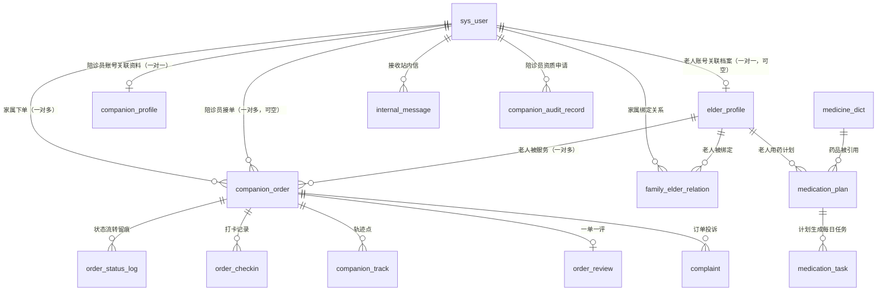
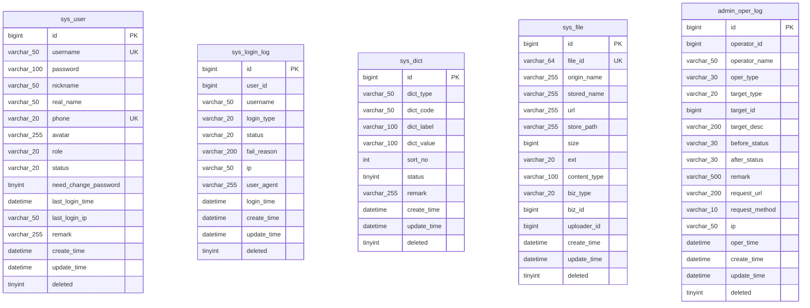
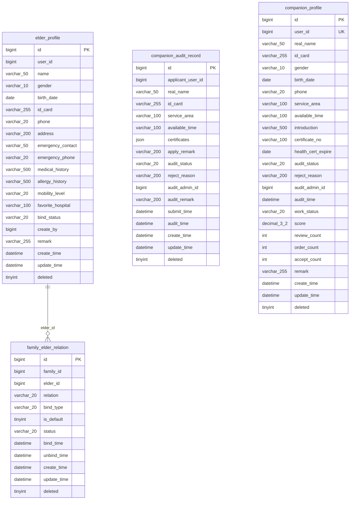
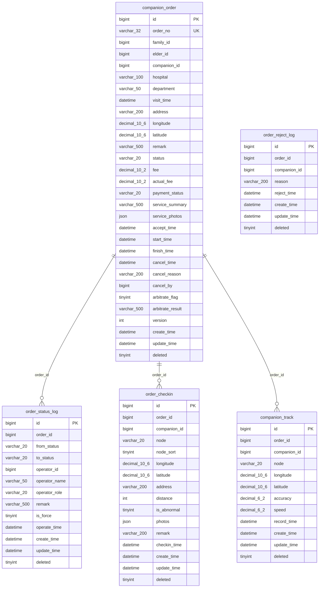
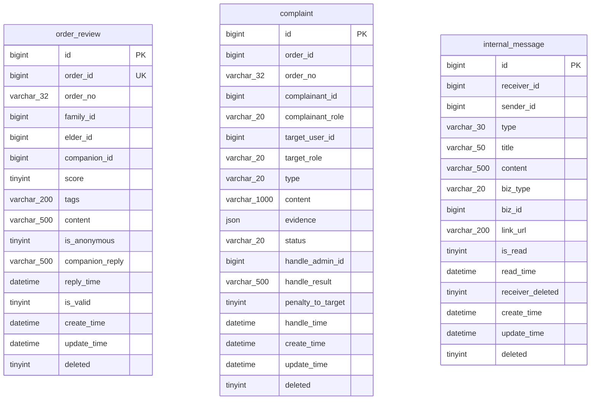
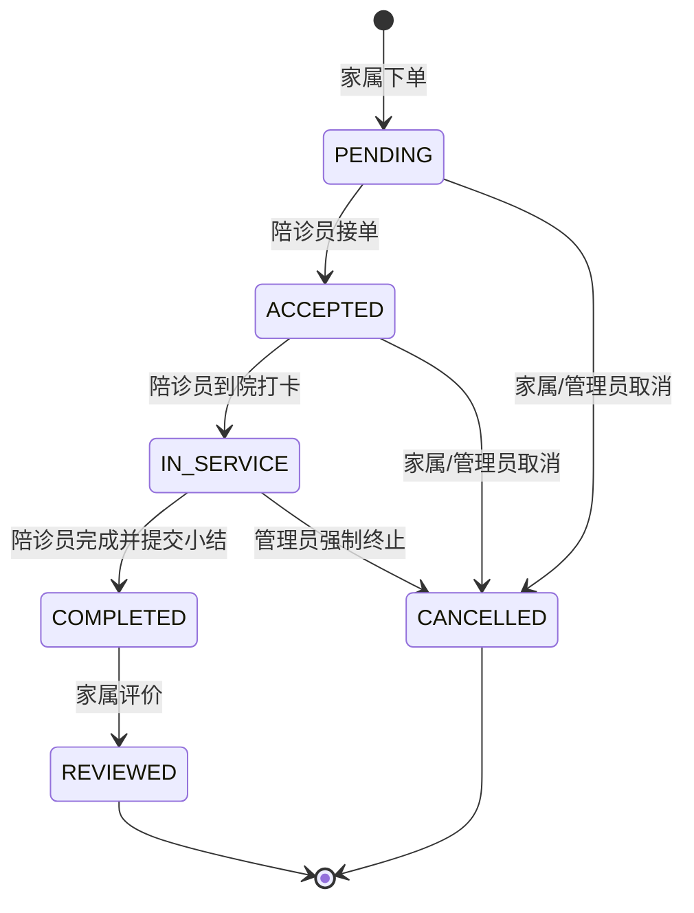

# 银龄伴诊 · ER 图与实体关系（M1）

> mermaid 语法，支持 GitHub / VS Code / Typora 直接渲染。

## 一、实体关系总览（逻辑模型）

## 二、关系明细

| 主表 | 从表 | 外键列 | 基数 | 说明 |
|---|---|---|---|---|
| `sys_user` | `companion_order` | `family_id` | 1 : N | 家属下单（一对多） |
| `sys_user` | `companion_order` | `companion_id` | 1 : N | 陪诊员接单（一对多，可空） |
| `elder_profile` | `companion_order` | `elder_id` | 1 : N | 老人被服务（一对多） |
| `sys_user` | `elder_profile` | `user_id` | 1 : 1 或 0 | 老人账号关联档案（一对一，可空） |
| `sys_user` | `companion_profile` | `user_id` | 1 : 1 或 0 | 陪诊员账号关联资料（一对一） |
| `sys_user` | `family_elder_relation` | `family_id` | 1 : N | 家属绑定关系 |
| `elder_profile` | `family_elder_relation` | `elder_id` | 1 : N | 老人被绑定 |
| `companion_order` | `order_status_log` | `order_id` | 1 : N | 状态流转留痕 |
| `companion_order` | `order_checkin` | `order_id` | 1 : N | 打卡记录 |
| `companion_order` | `companion_track` | `order_id` | 1 : N | 轨迹点 |
| `companion_order` | `order_review` | `order_id` | 1 : 1 或 0 | 一单一评 |
| `companion_order` | `complaint` | `order_id` | 1 : N | 订单投诉 |
| `elder_profile` | `medication_plan` | `elder_id` | 1 : N | 老人用药计划 |
| `medicine_dict` | `medication_plan` | `medicine_id` | 1 : N | 药品被引用 |
| `medication_plan` | `medication_task` | `plan_id` | 1 : N | 计划生成每日任务 |
| `sys_user` | `internal_message` | `receiver_id` | 1 : N | 接收站内信 |
| `sys_user` | `companion_audit_record` | `applicant_user_id` | 1 : N | 陪诊员资质申请 |

> **不建物理外键**。原因：① 课程设计需演示并发接单、批量导入，外键会加剧锁竞争；
> ② 逻辑删除（`deleted=1`）与物理外键的 `ON DELETE` 语义冲突；
> ③ 参照完整性由 Service 层 + 唯一索引共同保证。详见 `03-索引设计与EXPLAIN.md`。

## 三、分域 ER 图（物理模型，含字段）

### 3.1 一、账号与权限域

### 3.2 二、老人档案与陪诊员资质域

### 3.3 三、陪诊订单与执行域（系统核心）

### 3.4 四、用药管理域

```mermaid
erDiagram
    medicine_dict {
        bigint id PK
        varchar_100 name
        varchar_100 trade_name
        varchar_100 specification
        varchar_20 dosage_form
        varchar_500 common_usage
        varchar_500 precautions
        varchar_200 storage
        varchar_100 manufacturer
        varchar_50 approval_no
        varchar_20 otc_type
        tinyint is_common
        varchar_500 disclaimer
        datetime create_time
        datetime update_time
        tinyint deleted
    }
    medication_plan {
        bigint id PK
        bigint elder_id
        bigint medicine_id
        varchar_100 medicine_name
        varchar_50 dosage
        tinyint frequency
        varchar_100 time_points
        date start_date
        date end_date
        varchar_20 meal_relation
        varchar_20 status
        varchar_200 remark
        bigint created_by
        datetime create_time
        datetime update_time
        tinyint deleted
    }
    medication_task {
        bigint id PK
        bigint plan_id
        bigint elder_id
        bigint medicine_id
        varchar_100 medicine_name
        varchar_50 dosage
        varchar_20 meal_relation
        date plan_date
        datetime plan_time
        varchar_20 status
        tinyint was_missed
        datetime confirm_time
        bigint confirm_by
        varchar_200 confirm_remark
        tinyint notify_sent
        datetime notify_time
        datetime create_time
        datetime update_time
        tinyint deleted
    }
    medicine_dict ||--o{ medication_plan : "medicine_id"
    medication_plan ||--o{ medication_task : "plan_id"
```

### 3.5 五、评价、投诉与消息域

## 四、订单状态机

`companion_order.status` 的合法流转路径。**禁止跳级、禁止回退**，
仅管理员可强制改终态（写入 `order_status_log.is_force = 1`）。

| 状态 | 枚举值 | 可执行操作 | 写入的日志 |
|---|---|---|---|
| 待接单 | `PENDING` | 陪诊员接单 / 家属取消 / 陪诊员拒单（不改状态） | `order_status_log` + `order_reject_log` |
| 已接单 | `ACCEPTED` | 陪诊员到院打卡 / 取消 | `order_status_log` + `order_checkin` |
| 服务中 | `IN_SERVICE` | 节点打卡 / 上传轨迹 / 提交小结完成 | `order_status_log` + `order_checkin` + `companion_track` |
| 已完成 | `COMPLETED` | 家属评价 / 管理员核定结算 | `order_status_log` + `companion_profile` 聚合 |
| 已评价 | `REVIEWED` | 终态 | `order_review` |
| 已取消 | `CANCELLED` | 终态 | `order_status_log`（`is_force` 标记强制） |

> 并发接单防超卖：`companion_order.version` 配 MyBatis-Plus `@Version` 乐观锁，
> 两名陪诊员同时接单只有一人 `UPDATE ... WHERE version = ?` 影响行数为 1。
