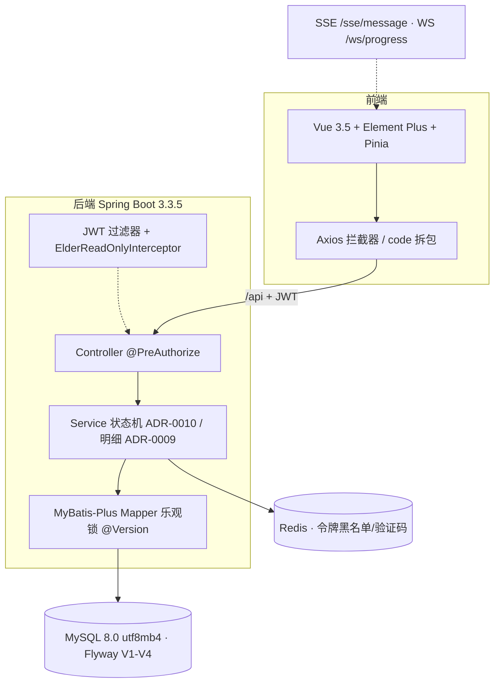

# 系统架构图

```mermaid
graph TB
  subgraph 前端
    V[Vue 3.5 + Element Plus + Pinia] --> AX[Axios 拦截器 / code 拆包]
  end
  subgraph 后端 Spring Boot 3.3.5
    C[Controller @PreAuthorize] --> S[Service 状态机 ADR-0010 / 明细 ADR-0009]
    S --> M[MyBatis-Plus Mapper 乐观锁 @Version]
    SEC[JWT 过滤器 + ElderReadOnlyInterceptor] -.-> C
  end
  AX -->|/api + JWT| C
  M --> DB[(MySQL 8.0 utf8mb4 · Flyway V1-V4)]
  S --> R[(Redis · 令牌黑名单/验证码)]
  W[SSE /sse/message · WS /ws/progress] -.-> V
```
