# 原型图（真实页面截图）

> 收尾标准要求用真实页面截图而非手绘。以下截图由 `frontend/e2e/capture-screenshots.mjs`
> 对着运行中的系统采集（Playwright + 本机 Chrome，1440×900，全页截图），
> 原图位于 `docs/reports/screenshots/`。

## 登录页

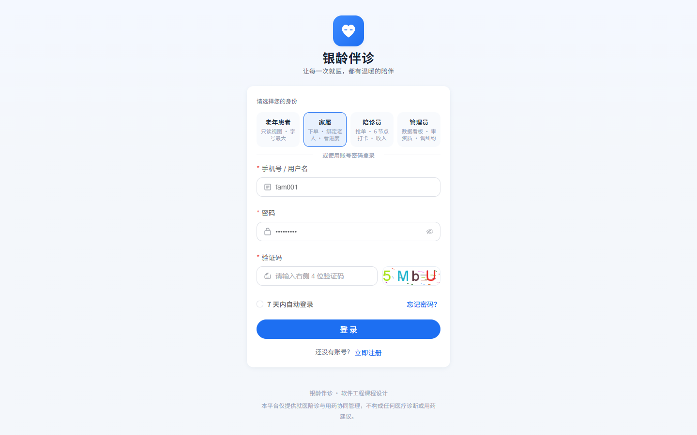

四角色共用的登录入口，带图形验证码与演示账号预填。

## 家属端

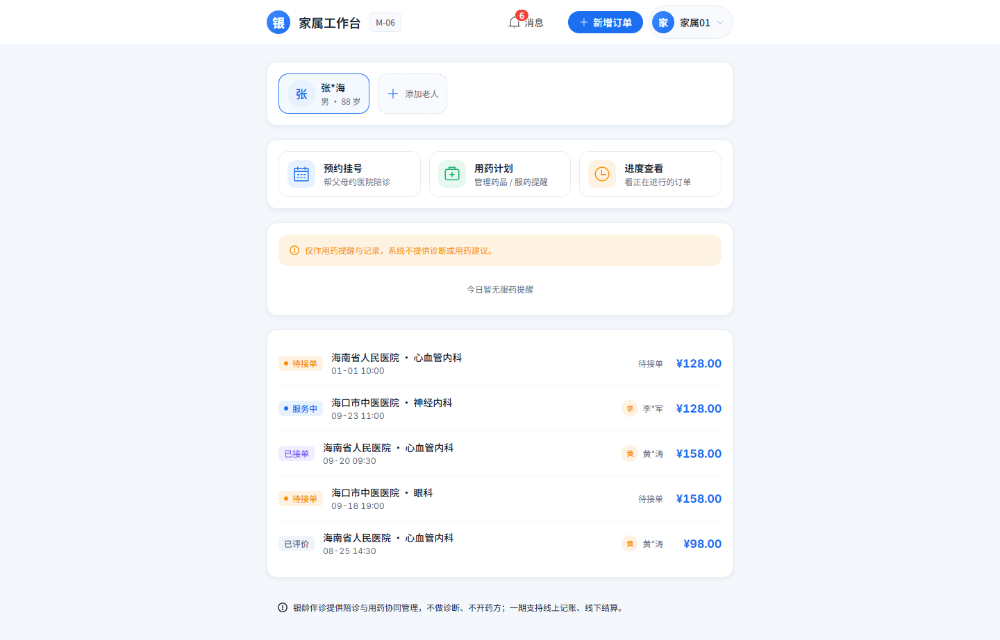

家属工作台：待办提醒、老人卡片与快捷入口。

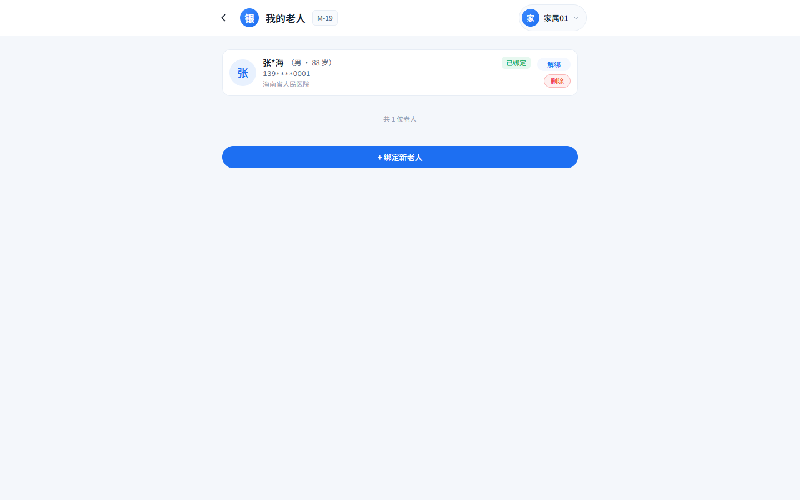

家属为老人建档与绑定（代操作关系的来源，M3）。

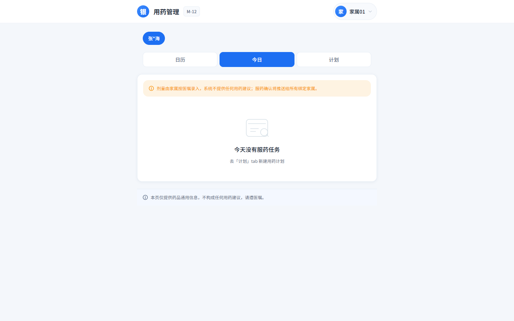

家属侧的用药计划与每日任务视图（M6，月历组件）。

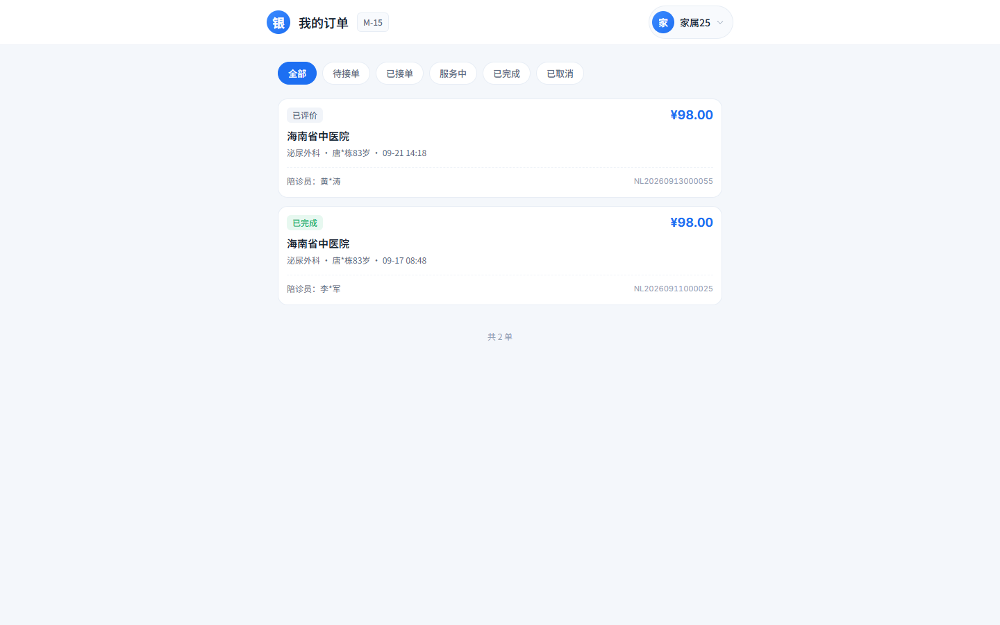

家属名下的陪诊订单列表（M4 状态机贯穿全程）。

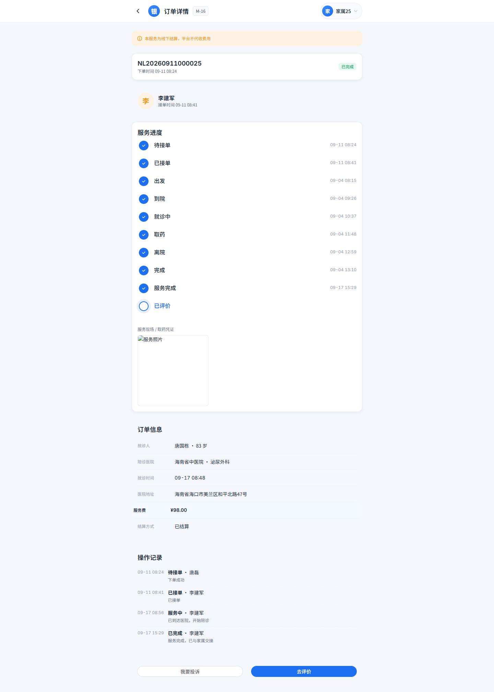

订单详情：状态时间线、服务记录与费用信息。

## 老人端

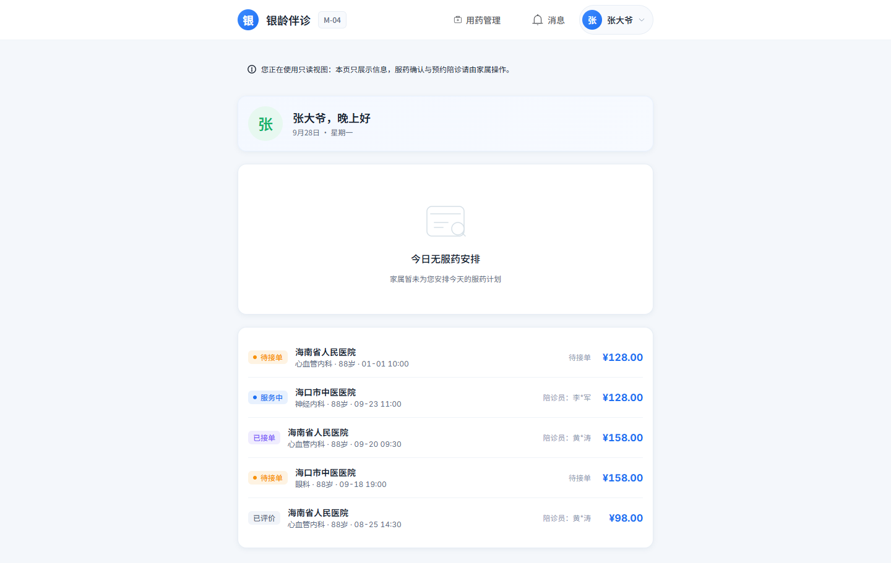

老人端大字号首页（适老化，Mobile 形态生效老人模式）。

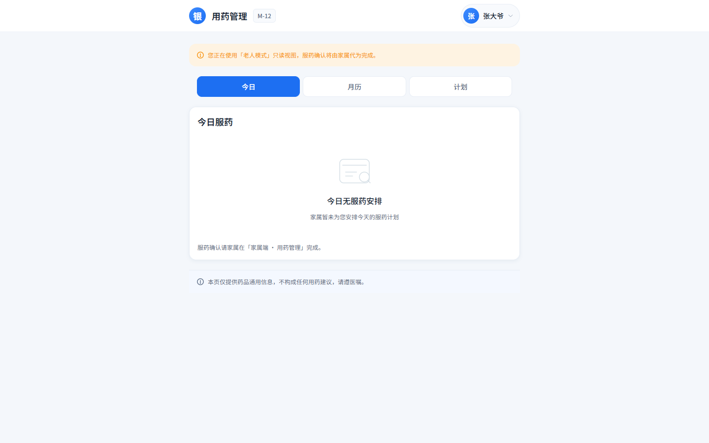

老人视角的今日用药（只读，写操作由家属代完成）。

## 陪诊员端

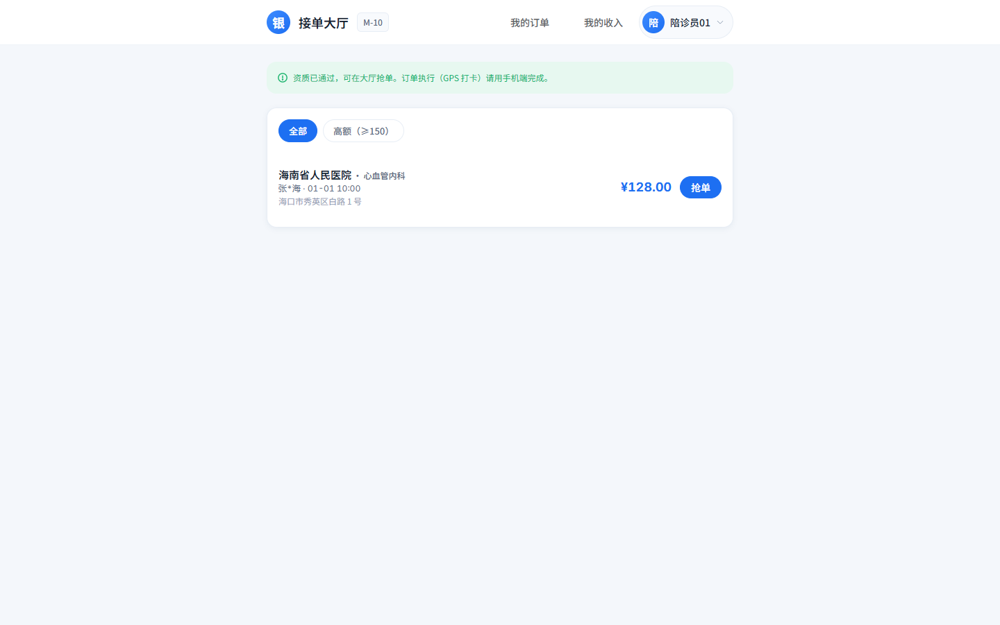

待接单订单大厅（接单走乐观锁防超卖，M4 验收点）。

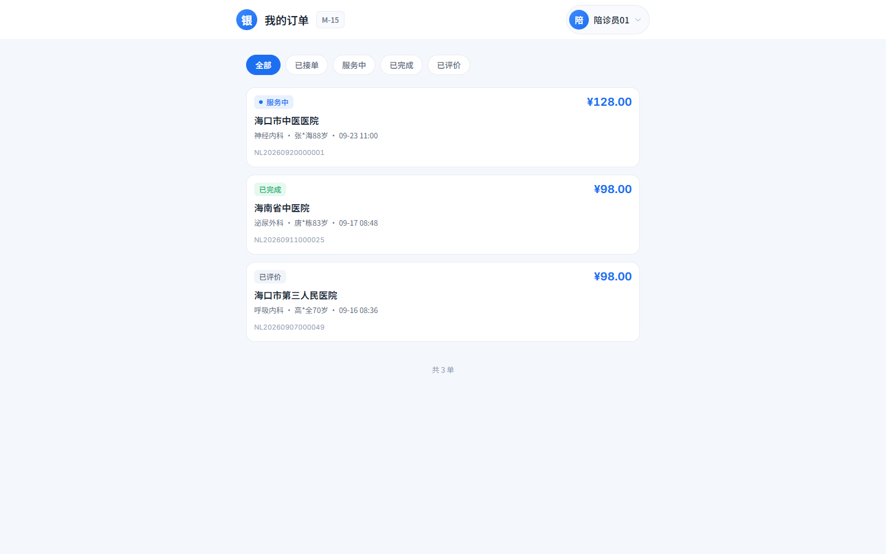

陪诊员名下订单与执行入口。

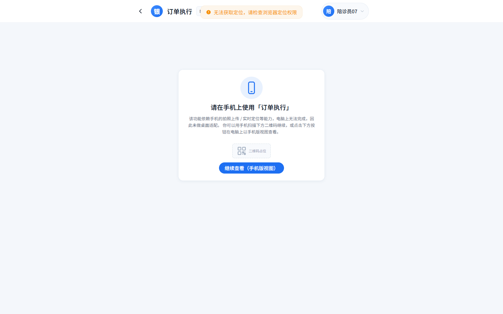

六节点打卡（出发/到院/就诊中/取药/离院/完成，M5）。

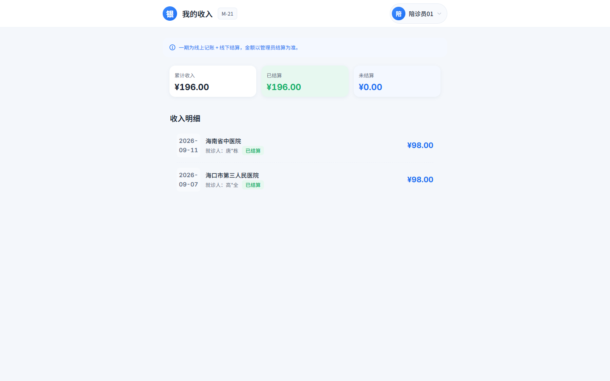

陪诊员收入与费用明细记账入口（ADR-0009）。

## 管理端

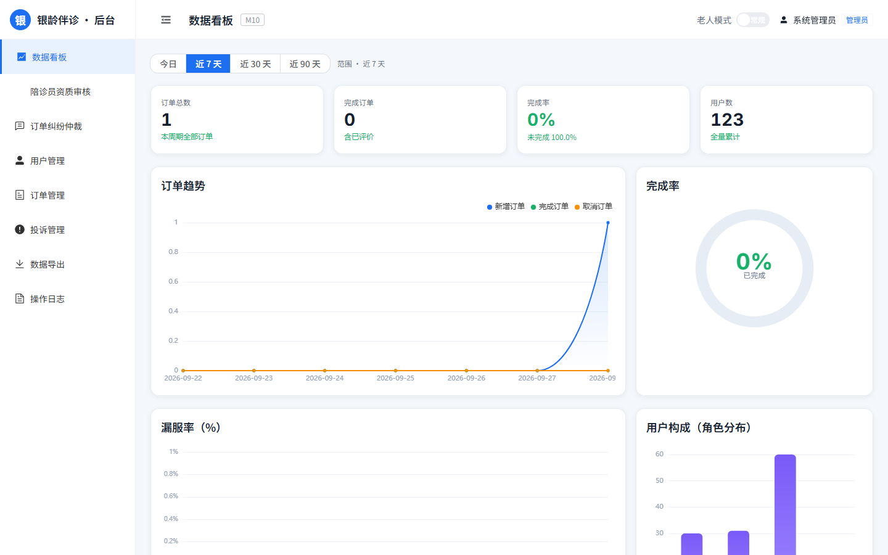

管理端统计看板。

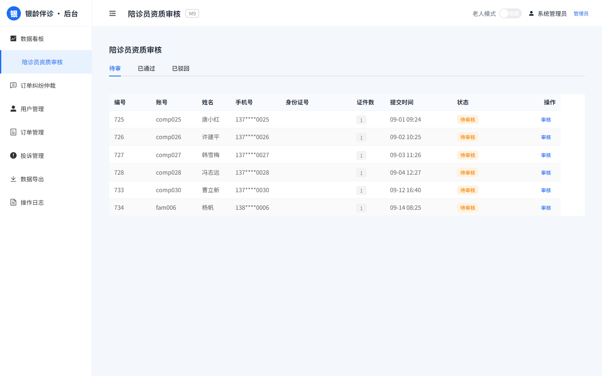

资质审核工作台（审核通过才升级为 COMPANION）。

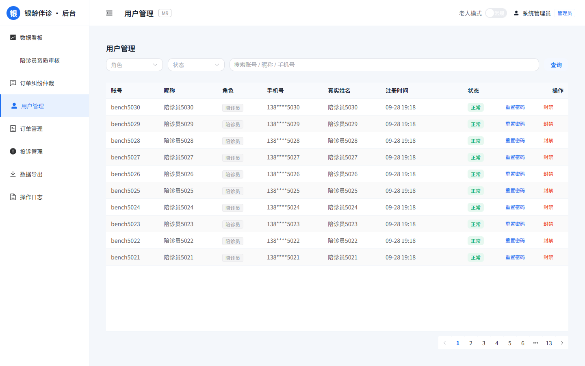

四角色用户管理列表。
