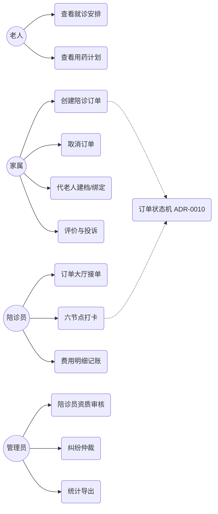

# 系统用例图

```mermaid
graph LR
  ELDER((老人)) --> U1(查看就诊安排)
  ELDER --> U2(查看用药计划)
  FAMILY((家属)) --> U3(创建陪诊订单)
  FAMILY --> U4(取消订单)
  FAMILY --> U5(代老人建档/绑定)
  FAMILY --> U6(评价与投诉)
  COMPANION((陪诊员)) --> U7(订单大厅接单)
  COMPANION --> U8(六节点打卡)
  COMPANION --> U9(费用明细记账)
  ADMIN((管理员)) --> U10(陪诊员资质审核)
  ADMIN --> U11(纠纷仲裁)
  ADMIN --> U12(统计导出)
  U3 -.-> S(订单状态机 ADR-0010)
  U8 -.-> S
```
