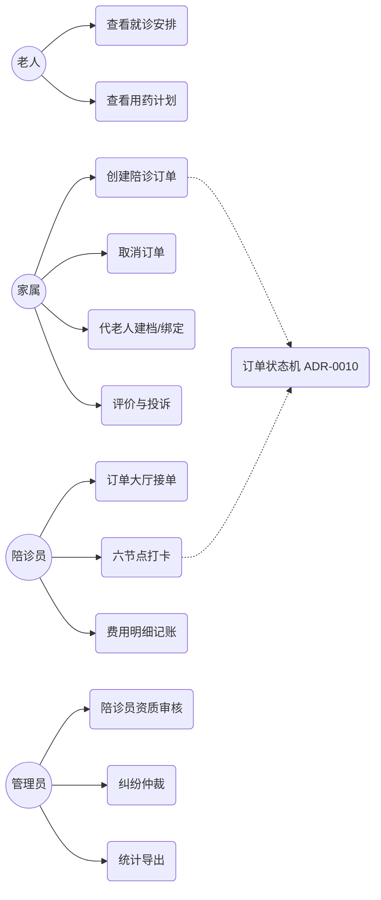
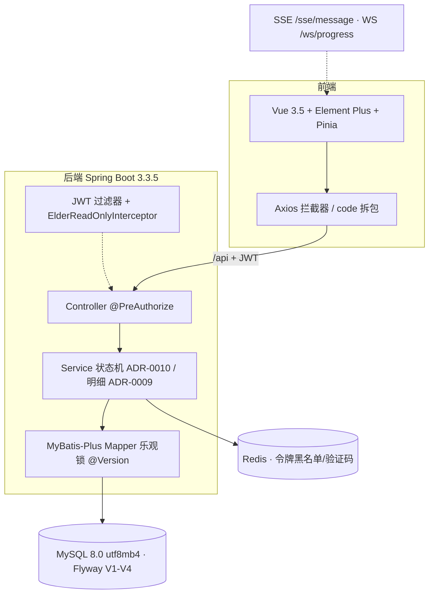

# 收敛迭代收尾（阶段 2 后半 + 阶段 3/4/5）实施计划

> **For agentic workers:** REQUIRED SUB-SKILL: Use superpowers:subagent-driven-development (recommended) or superpowers:executing-plans to implement this plan task-by-task. Steps use checkbox (`- [ ]`) syntax for tracking.

**Goal:** 把交接文档（handoff-nianglin-convergence-2026-09-28.md）里的 T2.3 / T2.5 与阶段 3 / 4 / 5 的 6 组 ticket，落成每步带验证命令与预期输出的小步任务，全部跑完后 `plan.md` 78 个 checkbox 可回填、`tools/verify_all.ps1` 总闸门可用。

**Architecture:** 严格按 A → B → C → D → E → F 顺序推进（前一步红了就停）。A/B/C 在当前分支 `fix/hard-constraint-convergence`（PR-2 范围）；D/E/F 各起新分支，且**上一阶段 PR 合并后才进下一阶段**。所有验证命令都是本机可执行的一行命令，预期输出写实。

**Tech Stack:** Spring Boot 3.3.5 / JDK 21 / MyBatis-Plus 3.5.7 / Flyway / JUnit5 + MockMvc；Vue 3.5 + Vite 6 + Element Plus + Pinia（pnpm）；Playwright；JMeter 5.6.3；PowerShell 5+。

**Spec:**
- 交接文档：`C:/Users/wang/AppData/Local/Temp/handoff-nianglin-convergence-2026-09-28.md`（本计划的事实来源）
- 迭代唯一真源：`docs/plan/convergence-2026-09.md`（§五 21 ticket + 收尾标准）
- 基线报告：`docs/agents/reports/BASELINE_2026-09-28.md`（数字直接引用，不重测）
- 设计依据：`docs/adr/0009-order-fee-item-model.md`（B 组照做）· `docs/adr/0010`（状态流转入口，已落地）· `AGENTS.md`

## Global Constraints（每个任务都隐含遵守）

1. **Flyway 红线**：`V1__init_schema.sql` / `V2__seed_data.sql` / `V3__seed_boundary.sql` 已执行，**连注释都不能改**（`validate-on-migrate: true` 校验 checksum）。要改数据只能新开 `V4__*.sql` 及以后。
2. **测试红了的处理**：先按四层排查（测试契约声明 → 生产代码校验 → 种子声明值 → 实际库值 + `update_time`）。前三层一致、第四层不一致 = 夹具漂移，修数据不修测试；改完跑**全量**复验。
3. **业务失败一律 HTTP 200 + code 拆包**；只有 401/403 用真实 HTTP 状态码。不要把业务失败做成 500。
4. **合规红线**：不做诊断、不开药方；日志与返回值先过 `MaskUtil`；不写明文口令。
5. **不改 `pom.xml` / `package.json` 依赖**（需人工确认）。不新增运行时依赖。
6. **`git commit` / `git push` / 删分支 / 重启服务：执行前必须向用户确认**（AGENTS.md §7.3 + 铁律 6）。本计划里的 commit 步骤都带合规的提交信息，但落手前先问。
7. **每阶段 PR 不合并不进下一阶段**（convergence §三）。D/E/F 开新分支前确认上一 PR 已合并。
8. **PowerShell 陷阱**：Maven 一律 `cmd /c 'cd /d "F:\test\Senior Companion Health Assessment\backend" && mvn.cmd ...'` 包装；多个测试类用逗号 `-Dtest=A,B`（不是 `+`）。
9. **验证顺序**：`pnpm build` 必须排在 `pnpm lint` 之后跑（lint 不编译 SCSS，样式表错误只有 build 能抓）。
10. **环境**：`MYSQL_PASSWORD` 环境变量必须已设（后端跑测试需要）；MySQL 8.0.42@3306、Redis@6379、JMeter `F:\software\apache-jmeter-5.6.3`（`JMETER_HOME` 已人工 setx）。
11. **接口先行**（AGENTS.md §8）：新增/修改接口先改 `docs/api/<n>-<module>.md`，再改后端，再改前端 `src/api/<module>.js`。
12. **金额**：接口与前端一律字符串两位小数（`"35.50"`）；时间 `yyyy-MM-dd HH:mm:ss`。
13. **老人账号（ELDER）写操作一律 403**（`ElderReadOnlyInterceptor` 服务端拦截，不靠前端藏按钮）。

---

## 阶段 0 · 起点确认

### Task 0: 确认起点没坏（5 分钟）

**Files:** 无改动，只读验证。

- [ ] **Step 1: 确认分支与工作区状态**

```powershell
git branch --show-current
git status --porcelain
```

Expected: 分支 = `fix/hard-constraint-convergence`；porcelain 恰好 3 行：`M CONTEXT.md`、`M docs/agents/designs/M4-order.md`、`?? docs/adr/0009-order-fee-item-model.md`（这 3 个是 Task C 的内容，**先不要提交**，等 Task B/C 一起）。

- [ ] **Step 2: 跑一次后端全量测试确认 585 绿**

```powershell
cmd /c 'cd /d "F:\test\Senior Companion Health Assessment\backend" && mvn.cmd test'
```

Expected: `Tests run: 585, Failures: 0, Errors: 0, Skipped: 0`、`BUILD SUCCESS`。若红了：停下，按 Global Constraint 2 排查，**不往后走**。

- [ ] **Step 3: 确认前端基线仍绿**

```powershell
cmd /c 'cd /d "F:\test\Senior Companion Health Assessment\frontend" && pnpm.cmd lint'
cmd /c 'cd /d "F:\test\Senior Companion Health Assessment\frontend" && pnpm.cmd build'
```

Expected: 两条 EXIT=0。

---

## 【A】T2.3 越权面补齐 + 探针退场（当前分支）

### Task A1: UserController 5 端点补显式 `@PreAuthorize`（15 分钟）

**Files:**
- Modify: `backend/src/main/java/org/company/nianglin/controller/user/UserController.java`（5 个端点方法，L61~L103）

**Interfaces:**
- Produces: 5 个端点显式标注 `@PreAuthorize("isAuthenticated()")`，与 `docs/api/02-elder-family.md` L134-138 的「已登录」口径一致；老人写 403 仍由 `ElderReadOnlyInterceptor` 承担（类 javadoc 已说明叠加关系，不改）。
- Consumes: `SecurityConfig` 已开启方法安全（`PermissionProbeController` 的 `@PreAuthorize` 生效中，证明可行）。

- [ ] **Step 1: 加 import**

在 `UserController.java` import 区加入：

```java
import org.springframework.security.access.prepost.PreAuthorize;
```

- [ ] **Step 2: 5 个端点方法各加一行注解**

`getProfile()`（L63 `@GetMapping("/profile")` 之前）、`updateProfile()`、`applyCompanion()`、`myCompanionApplication()`、`companionProfile()` 五个方法，都在各自 `@Operation` 与 Mapping 注解之间加：

```java
    @PreAuthorize("isAuthenticated()")
```

（与文档口径一致：5 个端点都是「已登录」；ELDER 的写拦截在拦截器层，不要在这里写 `hasAnyRole` 收紧——那会偏离 `docs/api/02-elder-family.md` 的既定设计。）

- [ ] **Step 3: 跑受影响的测试**

```powershell
cmd /c 'cd /d "F:\test\Senior Companion Health Assessment\backend" && mvn.cmd test -Dtest=OrderAccessMatrixTest,ElderOwnershipMatrixTest,PermissionMatrixTest'
```

Expected: 全绿（端点原本就被 `anyRequest().authenticated()` 兜着，显式注解不应改变行为）。若红：核对是「测试该改」还是「规则该松」（交接文档 ⚠️ 原话），红在权限语义上就停下来问用户。

- [ ] **Step 4: 全量测试确认**

```powershell
cmd /c 'cd /d "F:\test\Senior Companion Health Assessment\backend" && mvn.cmd test'
```

Expected: `Failures: 0, Errors: 0, Skipped: 0`。

### Task A2: 新建 `UserAccessMatrixTest`，12 条越权用例（1.5 小时）

**Files:**
- Create: `backend/src/test/java/org/company/nianglin/security/UserAccessMatrixTest.java`

**Interfaces:**
- Consumes: `TestTokens.bearer(tokenProvider, tokenStore, userId, role, tag)`（签真实 JWT，与 `OrderAccessMatrixTest` 同款）；种子账号 `fam001`(101) / `eld001`(201) / `comp001`(301) / `comp025`(325, 未过审) / `admin`(1)。
- Produces: M2 的「4 角色 × 3 类 = 12 条」在用户模块的正式落点 —— **这是 A3 删探针的前置条件**。探针退场后，`PermissionMatrixTest` 由本类与 7 个既有 `*AccessMatrixTest` 接棒。

**12 条用例矩阵（写进类 javadoc，逐条可定位）：**

| # | 类 | 角色 | 请求 | 期望 |
|---|---|---|---|---|
| 1 | ①未登录 | 匿名 | GET /api/user/profile | 401 |
| 2 | ①未登录 | 匿名 | PUT /api/user/profile | 401 |
| 3 | ①未登录 | 匿名 | POST /api/user/companion/apply | 401 |
| 4 | ①未登录 | 匿名 | GET /api/user/companion/301 | 401 |
| 5 | ②越权写 | ELDER | PUT /api/user/profile | 403，提示含「只读」 |
| 6 | ②越权写 | ELDER | POST /api/user/companion/apply | 403，提示含「只读」 |
| 7 | ②越权写(对照) | FAMILY | PUT /api/user/profile（合法昵称） | 200 |
| 8 | ②越权写(对照) | COMPANION | PUT /api/user/profile（合法昵称） | 200 |
| 9 | ②越权写(对照) | ADMIN | PUT /api/user/profile（合法昵称） | 200 |
| 10 | ③越权读 | FAMILY | GET /api/user/companion/999999 | code=2007 |
| 11 | ③越权读 | FAMILY | GET /api/user/companion/325（未过审） | code=2007（不泄露未过审者资料） |
| 12 | ③越权读 | FAMILY | GET /api/user/companion/application（从未申请） | data 缺省（non_null） |

（②类三对照覆盖 FAMILY/COMPANION/ADMIN + 拒绝侧覆盖 ELDER，四角色齐；①类覆盖全部端点形态；③类断言「公开资料的边界」。）

- [ ] **Step 1: 写测试类（完整文件）**

```java
package org.company.nianglin.security;

import org.company.nianglin.common.ResultCode;
import org.company.nianglin.constant.RoleConstants;
import org.company.nianglin.support.TestTokens;
import org.junit.jupiter.api.DisplayName;
import org.junit.jupiter.api.Test;
import org.junit.jupiter.params.ParameterizedTest;
import org.junit.jupiter.params.provider.CsvSource;
import org.springframework.beans.factory.annotation.Autowired;
import org.springframework.boot.test.autoconfigure.web.servlet.AutoConfigureMockMvc;
import org.springframework.boot.test.context.SpringBootTest;
import org.springframework.http.MediaType;
import org.springframework.test.web.servlet.MockMvc;
import org.springframework.transaction.annotation.Transactional;

import static org.hamcrest.Matchers.containsString;
import static org.springframework.test.web.servlet.request.MockMvcRequestBuilders.get;
import static org.springframework.test.web.servlet.request.MockMvcRequestBuilders.post;
import static org.springframework.test.web.servlet.request.MockMvcRequestBuilders.put;
import static org.springframework.test.web.servlet.result.MockMvcResultMatchers.jsonPath;
import static org.springframework.test.web.servlet.result.MockMvcResultMatchers.status;

/**
 * 用户模块越权矩阵：4 角色 × 3 类（未登录 / 越权读他人 / 越权写）= 12 条。
 *
 * <p><b>为什么存在</b>：M2 的 12 条验收用例原先挂在 {@code PermissionProbeController}
 * 探针上；探针的使命在各业务模块落地后结束（收敛迭代 T2.3）。删除探针的
 * <b>前置条件</b>是同等强度的回归网已织进真实业务接口 —— 即本类与
 * {@code OrderAccessMatrixTest} 等 7 个模块矩阵。</p>
 *
 * <h3>12 条用例矩阵（与类内测试一一对应）</h3>
 * <ol>
 *   <li>① 未登录 × 4 端点形态 → 401（用例 1-4）</li>
 *   <li>② 越权写：ELDER 被「只读规则」拦 2 条（用例 5-6）；FAMILY/COMPANION/ADMIN 放行对照 3 条（用例 7-9）</li>
 *   <li>③ 越权读：公开资料边界 3 条 —— 不存在 2007 / 未过审 2007 / 从未申请 data 缺省（用例 10-12）</li>
 * </ol>
 *
 * <p>探针的「写接口四角色全被拒」语义由 Order 等模块矩阵的「老人只读」段继承，
 * 这里用真实业务写接口（{@code PUT /profile}）表达同一规则。</p>
 *
 * @author 银龄伴诊团队
 * @since 收敛迭代 T2.3
 */
@SpringBootTest
@AutoConfigureMockMvc
@DisplayName("M2/M3 用户模块越权矩阵：4 角色 × 3 类 = 12 条（探针退场的回归网）")
class UserAccessMatrixTest {

    private static final String AUTH_HEADER = "Authorization";
    private static final String JSON = MediaType.APPLICATION_JSON_VALUE;

    private static final long ADMIN_ID = 1L;
    private static final long FAMILY_ID = 101L;
    private static final long ELDER_ID = 201L;
    private static final long COMPANION_APPROVED = 301L;
    /** 种子里 audit_status = PENDING 的陪诊员（V2 声明，与 OrderAccessMatrixTest 同源） */
    private static final long COMPANION_PENDING = 325L;
    private static final long NOT_EXIST_COMPANION = 999999L;

    @Autowired
    private MockMvc mockMvc;

    @Autowired
    private JwtTokenProvider tokenProvider;

    /** 密码版本必须读实时值 —— 登出会 bump 版本，写死 0 会被历史遗留状态击穿 */
    @Autowired
    private TokenStore tokenStore;

    /* ============ ① 未登录（4 条）：所有端点形态都对匿名关闭 ============ */

    @ParameterizedTest(name = "未登录 · {0} → 401")
    @CsvSource({
            "GET,/api/user/profile",
            "PUT,/api/user/profile",
            "POST,/api/user/companion/apply",
            "GET,/api/user/companion/301"})
    @DisplayName("未登录 · 用户模块 4 类端点 → 401")
    void anonymousShouldGet401OnEveryEndpointShape(String method, String path) throws Exception {
        var request = switch (method) {
            case "GET" -> get(path);
            case "PUT" -> put(path).contentType(JSON).content("{}");
            case "POST" -> post(path).contentType(JSON).content("{}");
            default -> throw new IllegalArgumentException(method);
        };
        mockMvc.perform(request)
                .andExpect(status().isUnauthorized())
                .andExpect(jsonPath("$.code").value(401));
    }

    /* ============ ② 越权写（5 条）：ELDER 只读 + 三角色对照 ============ */

    @Test
    @DisplayName("越权写 · 老人改资料 → 403，且提示语解释「只读」")
    void elderShouldBeBlockedOnUpdateProfile() throws Exception {
        mockMvc.perform(put("/api/user/profile").header(AUTH_HEADER, elder())
                        .contentType(JSON).content("{\"nickname\":\"老人改名\"}"))
                .andExpect(status().isForbidden())
                .andExpect(jsonPath("$.code").value(403))
                .andExpect(jsonPath("$.message").value(containsString("只读")));
    }

    @Test
    @DisplayName("越权写 · 老人提交陪诊员申请 → 403（只读规则只有一条，没有例外清单）")
    void elderShouldBeBlockedOnCompanionApply() throws Exception {
        mockMvc.perform(post("/api/user/companion/apply").header(AUTH_HEADER, elder())
                        .contentType(JSON).content("{}"))
                .andExpect(status().isForbidden())
                .andExpect(jsonPath("$.code").value(403))
                .andExpect(jsonPath("$.message").value(containsString("只读")));
    }

    @ParameterizedTest(name = "越权写对照 · {0} 改自己资料 → 200")
    @ValueSource(strings = {RoleConstants.FAMILY, RoleConstants.COMPANION, RoleConstants.ADMIN})
    @Transactional
    @DisplayName("越权写对照 · 三角色改自己昵称 → 200（测试事务回滚，不留痕）")
    void nonElderShouldUpdateOwnProfile(String role) throws Exception {
        long userId = switch (role) {
            case RoleConstants.FAMILY -> FAMILY_ID;
            case RoleConstants.COMPANION -> COMPANION_APPROVED;
            default -> ADMIN_ID;
        };
        mockMvc.perform(put("/api/user/profile").header(AUTH_HEADER, token(userId, role))
                        .contentType(JSON).content("{\"nickname\":\"矩阵测试昵称\"}"))
                .andExpect(status().isOk())
                .andExpect(jsonPath("$.code").value(200));
    }

    /* ============ ③ 越权读 / 公开资料边界（3 条） ============ */

    @Test
    @DisplayName("越权读 · 陪诊员公开资料不存在 → 2007")
    void missingCompanionShouldReturn2007() throws Exception {
        mockMvc.perform(get("/api/user/companion/{id}", NOT_EXIST_COMPANION)
                        .header(AUTH_HEADER, token(FAMILY_ID, RoleConstants.FAMILY)))
                .andExpect(status().isOk())
                .andExpect(jsonPath("$.code").value(ResultCode.COMPANION_NOT_FOUND.getCode()));
    }

    @Test
    @DisplayName("越权读 · 未过审的陪诊员对外不算陪诊员 → 2007（不泄露审核中的人）")
    void pendingCompanionShouldNotBePublic() throws Exception {
        mockMvc.perform(get("/api/user/companion/{id}", COMPANION_PENDING)
                        .header(AUTH_HEADER, token(FAMILY_ID, RoleConstants.FAMILY)))
                .andExpect(status().isOk())
                .andExpect(jsonPath("$.code").value(ResultCode.COMPANION_NOT_FOUND.getCode()));
    }

    @Test
    @DisplayName("越权读 · 从未申请过资质 → data 缺省（non_null），不是报错")
    void neverAppliedShouldReturnNullData() throws Exception {
        // fam001 在种子里没有 companion_audit_record
        mockMvc.perform(get("/api/user/companion/application")
                        .header(AUTH_HEADER, token(FAMILY_ID, RoleConstants.FAMILY)))
                .andExpect(status().isOk())
                .andExpect(jsonPath("$.code").value(200))
                .andExpect(jsonPath("$.data").doesNotExist());
    }

    /* ============ 工具 ============ */

    private String elder() {
        return token(ELDER_ID, RoleConstants.ELDER);
    }

    /** 签真实 accessToken（密码版本取实时值）；已含 Bearer 前缀 */
    private String token(long userId, String role) {
        return TestTokens.bearer(tokenProvider, tokenStore, userId, role, "user-matrix");
    }
}
```

- [ ] **Step 2: 先跑一次，确认全绿（这是验证现状，不是 TDD 红）**

```powershell
cmd /c 'cd /d "F:\test\Senior Companion Health Assessment\backend" && mvn.cmd test -Dtest=UserAccessMatrixTest'
```

Expected: 12 条全绿。**若有红**：按四层排查 —— 例如 #12 若 fam001 在种子里其实有申请记录，改用另一个确实没申请过的种子家属（查 `V2__seed_data.sql` 的 `companion_audit_record`），**不许改断言语义凑绿**。

- [ ] **Step 3: 反向验证（证明这套回归网真的挂在真实接口上）**

临时把 `UserController.getProfile()` 的 `@PreAuthorize("isAuthenticated()")` 注释掉，再跑：

```powershell
cmd /c 'cd /d "F:\test\Senior Companion Health Assessment\backend" && mvn.cmd test -Dtest=UserAccessMatrixTest'
```

Expected: 仍全绿（因为 `SecurityConfig.anyRequest().authenticated()` 还兜着）—— 这说明**单删注解不够**，再把 `SecurityConfig` L173 的 `.anyRequest().authenticated()` 临时改成 `.permitAll()` 跑一次：

Expected: **未登录 4 条 + 部分越权用例变红** —— 证明断言真的在拦。改回原状，再跑一次确认全绿。

> 这一步的意义：探针退场后，这张网就是用户模块唯一的权限回归。网必须被证明是通的（踩一脚会叫），否则等于没织。

### Task A3: 探针退场（15 分钟 —— **必须 A2 全绿后才做**）

**Files:**
- Delete: `backend/src/main/java/org/company/nianglin/controller/common/PermissionProbeController.java`
- Delete: `backend/src/test/java/org/company/nianglin/security/PermissionMatrixTest.java`（它的 12 条挂在探针 URL 上，探针没了它必红；其语义已由 8 个 `*AccessMatrixTest` 承接）
- Modify: `backend/src/main/java/org/company/nianglin/controller/common/HealthController.java`（删 `demoError()`，即 L64 的 `TODO(W16)`）

- [ ] **Step 1: 全仓 grep 探针与 demo-error 的引用面**

```powershell
Select-String -Path (Get-ChildItem -Recurse -Include *.java,*.js,*.vue,*.md backend\src,frontend\src,frontend\e2e,tools,docs -File | ForEach-Object { $_.FullName }) -Pattern 'perm-probe|demo-error|PermissionMatrixTest' | ForEach-Object { "$($_.Path):$($_.LineNumber)" }
```

Expected: 命中集中在 `PermissionProbeController.java`、`PermissionMatrixTest.java`、`HealthController.java`，可能加 `docs/api/01-auth-user.md`。文档命中逐条改为指向 `UserAccessMatrixTest`；`frontend/`、`tools/`、`e2e/` **不应有命中** —— 若有，停下来处理完再删。

- [ ] **Step 2: 删两个文件 + 删 demoError 方法**

```powershell
git rm "backend/src/main/java/org/company/nianglin/controller/common/PermissionProbeController.java"
git rm "backend/src/test/java/org/company/nianglin/security/PermissionMatrixTest.java"
```

`HealthController.java`：删除整个 `demoError()` 方法（L61-66），以及随之不再使用的 `import org.company.nianglin.common.ResultCode;` 与 `import org.company.nianglin.exception.BusinessException;`。类 javadoc 里「验证全局异常处理器（demo-error）」那一条同时删掉。

- [ ] **Step 3: 全量测试**

```powershell
cmd /c 'cd /d "F:\test\Senior Companion Health Assessment\backend" && mvn.cmd test'
```

Expected: 全绿（用例总数比 585+12 少掉 PermissionMatrixTest 的条数，属预期）。

### Task A4: A 阶段收尾判据 + 提交

- [ ] **Step 1: 收尾判据（convergence T2.3 的 ②③）**

```powershell
Select-String -Path (Get-ChildItem -Recurse backend\src -File | ForEach-Object { $_.FullName }) -Pattern 'PermissionProbeController|TODO\(W16\)'
```

Expected: **无输出**（退出后无命中）。

```powershell
Select-String -Path (Get-ChildItem -Recurse backend\src\test -Include *AccessMatrixTest.java -File | ForEach-Object { $_.FullName }) -Pattern 'class '
```

Expected: **8 个**矩阵测试类（原 7 个 + User）。

- [ ] **Step 2: 提交（先向用户确认，再执行）**

```powershell
git add backend/src/main/java/org/company/nianglin/controller/user/UserController.java backend/src/main/java/org/company/nianglin/controller/common/HealthController.java backend/src/test/java/org/company/nianglin/security/UserAccessMatrixTest.java docs/api/01-auth-user.md
git commit -m "feat(M2): 用户模块越权矩阵 12 条落地，权限探针整体退场（T2.3）"
```

（删除的两个文件已在 Step 2 用 `git rm` 暂存，随本次提交一起进入。）

---

## 【B】T2.5 费用明细模型落地（ADR-0009，当前分支）

> 顺序：文档 → SQL → 实体 → 录入端点(TDD) → 查询端点(TDD) → 完成集成(TDD)。V1~V3 一行不动。

### Task B1: `docs/api/03-order.md` 先行 + `V4__order_fee_item.sql`（40 分钟）

**Files:**
- Modify: `docs/api/03-order.md`（新增「费用明细」小节）
- Create: `backend/sql/V4__order_fee_item.sql`

**Interfaces:**
- Produces（B3/B4/E1 都依赖的接口契约）：
  - `POST /api/order/{id}/fee-items` —— 权限 COMPANION（本单）；请求体 `{ itemType, itemName, amount, occurredAt }`；返回 `Result<OrderFeeItemVO>`；错误：3001 / 3002 / 4003 / 400(参数)。
  - `GET /api/order/{id}/fee-items` —— 权限相关方（家属本人 / 就诊老人 / 本单陪诊员 / ADMIN）；返回 `Result<OrderFeeItemSummaryVO>`；错误：3001 / 3004。

- [ ] **Step 1: 在 `docs/api/03-order.md` 状态机章节之后插入小节**

```markdown
## 费用明细（ADR-0009）

订单完成时随状态变更同事务生成服务费明细；服务中/完成后陪诊员可补记代垫。
`fee` / `actual_fee` 降级为明细 SUM 的汇总缓存，**读取时与明细不一致以明细为准**。
历史订单允许明细为空且仅 `actual_fee` 有值（兜底提示，不静默伪造明细）。

### 录入明细

`POST /api/order/{id}/fee-items`　权限：COMPANION（须为本单陪诊员；订单须 IN_SERVICE / COMPLETED）

| 字段 | 类型 | 必填 | 说明 |
|---|---|---|---|
| itemType | string | 是 | `ADVANCE`-代垫 / `SERVICE`-服务费 |
| itemName | string | 是 | ≤64 字，如「心内科挂号费」 |
| amount | string | 是 | 两位小数字符串，如 `"35.50"` |
| occurredAt | string | 是 | `yyyy-MM-dd HH:mm:ss` |

成功：`data` 为 `OrderFeeItemVO`（含 `itemTypeLabel` 中文）。完成态订单录入会同步重算 `actual_fee`。
错误：3001 订单不存在 · 3002 状态不允许 · 4003 非本单陪诊员 · 400 参数不合法

### 查询明细

`GET /api/order/{id}/fee-items`　权限：相关方（下单家属 / 就诊老人 / 本单陪诊员 / ADMIN）

`data`：`{ items[], advanceTotal, serviceTotal, total, hasItems, fallbackNotice }`，
金额均为字符串两位小数；`items` 为空且该单已有申报 `actual_fee` 时 `fallbackNotice = "该订单无明细记录"`。
错误：3001 订单不存在 · 3004 无权操作该订单
```

- [ ] **Step 2: 写 V4 脚本（完整文件）**

创建 `backend/sql/V4__order_fee_item.sql`：

```sql
-- =============================================================================
-- V4 · order_fee_item —— 订单费用明细表（代垫/服务费分账）
-- 依据：docs/adr/0009-order-fee-item-model.md（Accepted）
-- ⚠️ V1~V3 已被 Flyway 执行（validate-on-migrate 校验 checksum），本脚本为纯增量，
--    不得以任何形式改动 V1/V2/V3。
-- 口径：明细是真源；companion_order.actual_fee 由 SUM(amount) 派生，不一致以明细为准。
-- =============================================================================

CREATE TABLE IF NOT EXISTS `order_fee_item` (
  `id`          BIGINT        NOT NULL AUTO_INCREMENT COMMENT '明细 ID',
  `order_id`    BIGINT        NOT NULL                COMMENT '关联 companion_order.id',
  `item_type`   VARCHAR(16)   NOT NULL                COMMENT '费用类型：ADVANCE-代垫（家属还给陪诊员）/ SERVICE-服务费（平台结算或家属直付）',
  `item_name`   VARCHAR(64)   NOT NULL                COMMENT '项目名，如「心内科挂号费」「陪诊服务费」',
  `amount`      DECIMAL(10,2) NOT NULL                COMMENT '金额（元），两位小数',
  `occurred_at` DATETIME      NOT NULL                COMMENT '费用发生时间',
  `create_time` DATETIME      NOT NULL DEFAULT CURRENT_TIMESTAMP COMMENT '创建时间',
  `update_time` DATETIME      NOT NULL DEFAULT CURRENT_TIMESTAMP ON UPDATE CURRENT_TIMESTAMP COMMENT '更新时间',
  `deleted`     TINYINT       NOT NULL DEFAULT 0      COMMENT '逻辑删除：0-未删除 1-已删除',
  PRIMARY KEY (`id`),
  -- 按订单取明细 + 按类型分账（家属看代垫、平台看服务费）
  KEY `idx_order_type` (`order_id`, `item_type`),
  KEY `idx_occurred_at` (`occurred_at`)
) ENGINE=InnoDB DEFAULT CHARSET=utf8mb4 COLLATE=utf8mb4_general_ci COMMENT='订单费用明细表（代垫/服务费分账，ADR-0009）';
```

- [ ] **Step 3: 让 Flyway 应用并验证**

```powershell
cmd /c 'cd /d "F:\test\Senior Companion Health Assessment\backend" && mvn.cmd test -Dtest=OrderStatusTest'
& "C:\Program Files\MySQL\MySQL Server 8.0\bin\mysql.exe" -uroot -p"$env:MYSQL_PASSWORD" nianglin -e "SELECT version, description, success FROM flyway_schema_history ORDER BY installed_rank DESC LIMIT 1;"
```

Expected: 测试绿；SQL 查询输出 `4 | order_fee_item | 1`。（`@SpringBootTest` 连库会顺带执行迁移。）

### Task B2: `OrderFeeItem` 实体 + Mapper + 数据库文档再生成（30 分钟）

**Files:**
- Create: `backend/src/main/java/org/company/nianglin/entity/OrderFeeItem.java`
- Create: `backend/src/main/java/org/company/nianglin/mapper/OrderFeeItemMapper.java`
- Regenerate: `docs/db/`（由 `gen_db_docs.py`，勿手改）

**Interfaces:**
- Produces（B3/B4/B5 依赖）: `OrderFeeItem`（字段 `orderId` / `itemType` / `itemName` / `amount: BigDecimal` / `occurredAt: LocalDateTime`，审计字段继承 `BaseEntity`）；`OrderFeeItemMapper extends BaseMapper<OrderFeeItem>`。

- [ ] **Step 1: 实体（完整文件，沿用生成器风格）**

```java
package org.company.nianglin.entity;

import com.baomidou.mybatisplus.annotation.TableName;
import io.swagger.v3.oas.annotations.media.Schema;
import lombok.Data;
import lombok.EqualsAndHashCode;
import org.company.nianglin.common.BaseEntity;

import java.math.BigDecimal;
import java.time.LocalDateTime;

/**
 * OrderFeeItem —— 对应表 {@code order_fee_item}。
 *
 * <p>订单费用明细（ADR-0009）：代垫（ADVANCE，家属还给陪诊员）与服务费（SERVICE）
 * 分账，是线下结算的最小对账单元；{@code companion_order.actual_fee} 由明细
 * SUM 派生，读取时不一致以明细为准。</p>
 *
 * <p>⚠️ 本类为持久化实体，禁止直接作为接口返回值；对外统一转 VO。
 * 费用明细只记录支出项目与金额，**不含任何医疗诊断信息**（plan.md §一红线）。</p>
 *
 * @since M4（收敛迭代 T2.5）
 */
@Data
@EqualsAndHashCode(callSuper = true)
@TableName("order_fee_item")
public class OrderFeeItem extends BaseEntity {

    /**
     * 关联 companion_order.id
     */
    @Schema(description = "关联 companion_order.id")
    private Long orderId;

    /**
     * 费用类型：ADVANCE-代垫 / SERVICE-服务费
     */
    @Schema(description = "费用类型：ADVANCE-代垫（家属还给陪诊员）/ SERVICE-服务费")
    private String itemType;

    /**
     * 项目名，如「心内科挂号费」「陪诊服务费」
     */
    @Schema(description = "项目名，如「心内科挂号费」「陪诊服务费」")
    private String itemName;

    /**
     * 金额（元），两位小数
     */
    @Schema(description = "金额（元），两位小数")
    private BigDecimal amount;

    /**
     * 费用发生时间
     */
    @Schema(description = "费用发生时间")
    private LocalDateTime occurredAt;
}
```

- [ ] **Step 2: Mapper（完整文件）**

```java
package org.company.nianglin.mapper;

import com.baomidou.mybatisplus.core.mapper.BaseMapper;
import org.company.nianglin.entity.OrderFeeItem;

/**
 * OrderFeeItem 对应 Mapper（MyBatis-Plus，见 {@code MybatisPlusConfig} 的扫描配置）。
 *
 * @since M4（收敛迭代 T2.5）
 */
public interface OrderFeeItemMapper extends BaseMapper<OrderFeeItem> {
}
```

（对照 `OrderRejectLogMapper` 等既有 Mapper 的写法；若既有 Mapper 都带 `@Mapper` 注解就跟注，保持一致。）

- [ ] **Step 3: 编译 + 再生成数据库文档**

```powershell
cmd /c 'cd /d "F:\test\Senior Companion Health Assessment\backend" && mvn.cmd -q compile'
$env:PYTHONUTF8='1'; $env:PYTHONIOENCODING='utf-8'
python "F:\test\Senior Companion Health Assessment\backend\sql\tools\gen_db_docs.py"
```

Expected: 编译 EXIT=0；`docs/db/` 出现 `order_fee_item` 的表文档。`git status` 检查 `docs/db/` 变更只含本次新增表内容 —— 若生成器把无关文件大范围重写，停下来看差异再定。

### Task B3: 录入端点（TDD，1 小时）

**Files:**
- Create: `backend/src/main/java/org/company/nianglin/dto/FeeItemCreateDTO.java`
- Create: `backend/src/main/java/org/company/nianglin/vo/OrderFeeItemVO.java`
- Create: `backend/src/main/java/org/company/nianglin/vo/OrderFeeItemSummaryVO.java`
- Create: `backend/src/main/java/org/company/nianglin/service/OrderFeeItemService.java`
- Create: `backend/src/main/java/org/company/nianglin/service/impl/OrderFeeItemServiceImpl.java`
- Modify: `backend/src/main/java/org/company/nianglin/controller/order/OrderController.java`（追加 2 个端点）
- Test: `backend/src/test/java/org/company/nianglin/service/OrderFeeItemTest.java`

**Interfaces:**
- Consumes: Task B2 的 `OrderFeeItemMapper`；`ResultCode.NOT_ORDER_COMPANION(4003)` / `ORDER_STATUS_ILLEGAL(3002)` / `ORDER_NO_PERMISSION(3004)` / `ORDER_NOT_FOUND(3001)` / `PARAM_ERROR(400)`；种子订单 1001(PENDING) / 1007(ACCEPTED, 陪诊员 307) / 1025(COMPLETED, 家属 121, 陪诊员 301)。
- Produces: `OrderFeeItemService.create(Long orderId, FeeItemCreateDTO dto) → OrderFeeItemVO` 与 `listByOrder(Long orderId) → OrderFeeItemSummaryVO`（B4 复用 `listByOrder`，B5 复用本类）。

- [ ] **Step 1: 先写会失败的测试（完整文件）**

```java
package org.company.nianglin.service;

import com.baomidou.mybatisplus.core.toolkit.Wrappers;
import org.company.nianglin.common.ResultCode;
import org.company.nianglin.constant.RoleConstants;
import org.company.nianglin.entity.CompanionOrder;
import org.company.nianglin.mapper.CompanionOrderMapper;
import org.company.nianglin.support.TestTokens;
import org.junit.jupiter.api.DisplayName;
import org.junit.jupiter.api.Test;
import org.springframework.beans.factory.annotation.Autowired;
import org.springframework.boot.test.autoconfigure.web.servlet.AutoConfigureMockMvc;
import org.springframework.boot.test.context.SpringBootTest;
import org.springframework.http.MediaType;
import org.springframework.test.web.servlet.MockMvc;
import org.springframework.transaction.annotation.Transactional;

import static org.hamcrest.Matchers.containsString;
import static org.hamcrest.Matchers.hasSize;
import static org.springframework.test.web.servlet.request.MockMvcRequestBuilders.get;
import static org.springframework.test.web.servlet.request.MockMvcRequestBuilders.post;
import static org.springframework.test.web.servlet.result.MockMvcResultMatchers.jsonPath;
import static org.springframework.test.web.servlet.result.MockMvcResultMatchers.status;

/**
 * M4 费用明细（ADR-0009）：录入 / 查询 / 权限 / 兜底口径。
 *
 * <p>种子靶子（V2，与 OrderAccessMatrixTest 同源）：1001 PENDING；
 * 1007 ACCEPTED·陪诊员307；1025 COMPLETED·家属121·陪诊员301。
 * 写路径全部包在测试事务里回滚，不污染共享开发库。</p>
 */
@SpringBootTest
@AutoConfigureMockMvc
@DisplayName("M4 费用明细：代垫/服务费分账（ADR-0009）")
class OrderFeeItemTest {

    private static final String AUTH_HEADER = "Authorization";
    private static final String JSON = MediaType.APPLICATION_JSON_VALUE;

    private static final long ADMIN_ID = 1L;
    private static final long FAMILY_OF_1025 = 121L;
    private static final long FAMILY_OTHER = 101L;
    private static final long COMPANION_OF_1025 = 301L;
    private static final long COMPANION_OF_1007 = 307L;
    private static final long PENDING_ORDER = 1001L;
    private static final long ACCEPTED_ORDER = 1007L;
    private static final long COMPLETED_ORDER = 1025L;

    @Autowired
    private MockMvc mockMvc;

    @Autowired
    private JwtTokenProvider tokenProvider;

    @Autowired
    private TokenStore tokenStore;

    @Autowired
    private CompanionOrderMapper orderMapper;

    private String token(long userId, String role) {
        return TestTokens.bearer(tokenProvider, tokenStore, userId, role, "fee-item");
    }

    private String body(String type, String name, String amount) {
        return "{\"itemType\":\"" + type + "\",\"itemName\":\"" + name
                + "\",\"amount\":\"" + amount + "\",\"occurredAt\":\"2026-09-28 10:30:00\"}";
    }

    @Test
    @Transactional
    @DisplayName("录入 · 本单陪诊员给已完成订单记代垫 → 200，itemTypeLabel=代垫")
    void companionShouldCreateAdvanceItem() throws Exception {
        mockMvc.perform(post("/api/order/{id}/fee-items", COMPLETED_ORDER)
                        .header(AUTH_HEADER, token(COMPANION_OF_1025, RoleConstants.COMPANION))
                        .contentType(JSON).content(body("ADVANCE", "心内科挂号费", "35.50")))
                .andExpect(status().isOk())
                .andExpect(jsonPath("$.code").value(200))
                .andExpect(jsonPath("$.data.itemType").value("ADVANCE"))
                .andExpect(jsonPath("$.data.itemTypeLabel").value("代垫"))
                .andExpect(jsonPath("$.data.amount").value("35.50"));
    }

    @Test
    @Transactional
    @DisplayName("录入 · 完成态订单录入后 actual_fee 重算为明细求和（35.50）")
    void createShouldRecalcActualFeeOnCompletedOrder() throws Exception {
        mockMvc.perform(post("/api/order/{id}/fee-items", COMPLETED_ORDER)
                        .header(AUTH_HEADER, token(COMPANION_OF_1025, RoleConstants.COMPANION))
                        .contentType(JSON).content(body("ADVANCE", "挂号费", "35.50")))
                .andExpect(status().isOk());

        mockMvc.perform(get("/api/order/{id}", COMPLETED_ORDER)
                        .header(AUTH_HEADER, token(FAMILY_OF_1025, RoleConstants.FAMILY)))
                .andExpect(jsonPath("$.data.actualFee").value(35.50));
    }

    @Test
    @DisplayName("录入 · 非本单陪诊员 → 4003")
    void otherCompanionShouldReturn4003() throws Exception {
        mockMvc.perform(post("/api/order/{id}/fee-items", COMPLETED_ORDER)
                        .header(AUTH_HEADER, token(COMPANION_OF_1007, RoleConstants.COMPANION))
                        .contentType(JSON).content(body("ADVANCE", "挂号费", "1.00")))
                .andExpect(status().isOk())
                .andExpect(jsonPath("$.code").value(ResultCode.NOT_ORDER_COMPANION.getCode()));
    }

    @Test
    @Transactional
    @DisplayName("录入 · 已接单未开服务 → 3002（IN_SERVICE / COMPLETED 才能记账）")
    void acceptedOrderShouldReturn3002() throws Exception {
        mockMvc.perform(post("/api/order/{id}/fee-items", ACCEPTED_ORDER)
                        .header(AUTH_HEADER, token(COMPANION_OF_1007, RoleConstants.COMPANION))
                        .contentType(JSON).content(body("ADVANCE", "挂号费", "1.00")))
                .andExpect(status().isOk())
                .andExpect(jsonPath("$.code").value(ResultCode.ORDER_STATUS_ILLEGAL.getCode()));
    }

    @Test
    @DisplayName("录入 · 家属调录入端点 → 403（记账是陪诊员的事）")
    void familyShouldBeRejected403() throws Exception {
        mockMvc.perform(post("/api/order/{id}/fee-items", COMPLETED_ORDER)
                        .header(AUTH_HEADER, token(FAMILY_OF_1025, RoleConstants.FAMILY))
                        .contentType(JSON).content(body("ADVANCE", "挂号费", "1.00")))
                .andExpect(status().isForbidden())
                .andExpect(jsonPath("$.code").value(403));
    }

    @Test
    @Transactional
    @DisplayName("查询 · 相关方家属看到明细与分组合计")
    void ownerFamilyShouldListItems() throws Exception {
        mockMvc.perform(post("/api/order/{id}/fee-items", COMPLETED_ORDER)
                        .header(AUTH_HEADER, token(COMPANION_OF_1025, RoleConstants.COMPANION))
                        .contentType(JSON).content(body("ADVANCE", "挂号费", "35.50")))
                .andExpect(status().isOk());
        mockMvc.perform(post("/api/order/{id}/fee-items", COMPLETED_ORDER)
                        .header(AUTH_HEADER, token(COMPANION_OF_1025, RoleConstants.COMPANION))
                        .contentType(JSON).content(body("SERVICE", "陪诊服务费", "128.00")))
                .andExpect(status().isOk());

        mockMvc.perform(get("/api/order/{id}/fee-items", COMPLETED_ORDER)
                        .header(AUTH_HEADER, token(FAMILY_OF_1025, RoleConstants.FAMILY)))
                .andExpect(status().isOk())
                .andExpect(jsonPath("$.data.items", hasSize(2)))
                .andExpect(jsonPath("$.data.advanceTotal").value("35.50"))
                .andExpect(jsonPath("$.data.serviceTotal").value("128.00"))
                .andExpect(jsonPath("$.data.total").value("163.50"))
                .andExpect(jsonPath("$.data.hasItems").value(true));
    }

    @Test
    @DisplayName("查询 · 无关家属 → 3004")
    void otherFamilyShouldReturn3004() throws Exception {
        mockMvc.perform(get("/api/order/{id}/fee-items", COMPLETED_ORDER)
                        .header(AUTH_HEADER, token(FAMILY_OTHER, RoleConstants.FAMILY)))
                .andExpect(status().isOk())
                .andExpect(jsonPath("$.code").value(ResultCode.ORDER_NO_PERMISSION.getCode()));
    }

    @Test
    @Transactional
    @DisplayName("兜底 · 无明细且已有申报金额 → fallbackNotice 显式提示，不伪造明细")
    void emptyItemsWithDeclaredFeeShouldReturnFallbackNotice() throws Exception {
        // 构造确定前置：1025 无明细 + actual_fee 有值（测试事务内固定，结束回滚）
        assertTrue(orderMapper.update(null, Wrappers.<CompanionOrder>lambdaUpdate()
                .eq(CompanionOrder::getId, COMPLETED_ORDER)
                .set(CompanionOrder::getActualFee, new java.math.BigDecimal("128.00"))) > 0);

        mockMvc.perform(get("/api/order/{id}/fee-items", COMPLETED_ORDER)
                        .header(AUTH_HEADER, token(ADMIN_ID, RoleConstants.ADMIN)))
                .andExpect(status().isOk())
                .andExpect(jsonPath("$.data.hasItems").value(false))
                .andExpect(jsonPath("$.data.fallbackNotice").value(containsString("无明细")));
    }

    @Test
    @DisplayName("查询 · 订单不存在 → 3001")
    void missingOrderShouldReturn3001() throws Exception {
        mockMvc.perform(get("/api/order/{id}/fee-items", 999999L)
                        .header(AUTH_HEADER, token(ADMIN_ID, RoleConstants.ADMIN)))
                .andExpect(status().isOk())
                .andExpect(jsonPath("$.code").value(ResultCode.ORDER_NOT_FOUND.getCode()));
    }
}
```

（文件头部补齐 `import static org.junit.jupiter.api.Assertions.assertTrue;` 与本类用到的其余 import，与 `OrderAccessMatrixTest` 的 import 清单对齐。）

- [ ] **Step 2: 跑测试确认失败**

```powershell
cmd /c 'cd /d "F:\test\Senior Companion Health Assessment\backend" && mvn.cmd test -Dtest=OrderFeeItemTest'
```

Expected: **编译失败**（`/fee-items` 端点与 `OrderFeeItemService` 不存在）—— 这就是 TDD 的红。

- [ ] **Step 3: 写 DTO / VO / Service 接口（完整文件）**

`dto/FeeItemCreateDTO.java`：

```java
package org.company.nianglin.dto;

import io.swagger.v3.oas.annotations.media.Schema;
import jakarta.validation.constraints.NotBlank;
import jakarta.validation.constraints.NotNull;
import jakarta.validation.constraints.Pattern;
import jakarta.validation.constraints.Size;
import lombok.Data;

import java.time.LocalDateTime;

/**
 * 费用明细录入入参（ADR-0009）。
 */
@Data
@Schema(description = "费用明细录入入参")
public class FeeItemCreateDTO {

    @NotBlank(message = "费用类型不能为空")
    @Pattern(regexp = "ADVANCE|SERVICE", message = "费用类型只能是 ADVANCE（代垫）或 SERVICE（服务费）")
    @Schema(description = "费用类型：ADVANCE-代垫 / SERVICE-服务费", example = "ADVANCE")
    private String itemType;

    @NotBlank(message = "项目名不能为空")
    @Size(max = 64, message = "项目名不能超过 64 个字符")
    @Schema(description = "项目名，如「心内科挂号费」", example = "心内科挂号费")
    private String itemName;

    @NotBlank(message = "金额不能为空")
    @Pattern(regexp = "^\\d{1,6}(\\.\\d{1,2})?$", message = "金额须为最多两位小数的数字字符串")
    @Schema(description = "金额（元），字符串两位小数", example = "35.50")
    private String amount;

    @NotNull(message = "费用发生时间不能为空")
    @Schema(description = "费用发生时间", example = "2026-09-28 10:30:00")
    private LocalDateTime occurredAt;
}
```

`vo/OrderFeeItemVO.java`：

```java
package org.company.nianglin.vo;

import io.swagger.v3.oas.annotations.media.Schema;
import lombok.Data;
import org.company.nianglin.entity.OrderFeeItem;

import java.math.BigDecimal;
import java.math.RoundingMode;
import java.time.LocalDateTime;

/**
 * 费用明细出参（ADR-0009）。金额为字符串两位小数（AGENTS.md §4.4）。
 */
@Data
@Schema(description = "费用明细条目")
public class OrderFeeItemVO {

    @Schema(description = "明细 ID")
    private Long id;

    @Schema(description = "费用类型：ADVANCE / SERVICE")
    private String itemType;

    @Schema(description = "费用类型中文：代垫 / 服务费")
    private String itemTypeLabel;

    @Schema(description = "项目名")
    private String itemName;

    @Schema(description = "金额（元），字符串两位小数", example = "35.50")
    private String amount;

    @Schema(description = "费用发生时间")
    private LocalDateTime occurredAt;

    public static OrderFeeItemVO of(OrderFeeItem item) {
        OrderFeeItemVO vo = new OrderFeeItemVO();
        vo.setId(item.getId());
        vo.setItemType(item.getItemType());
        vo.setItemTypeLabel("ADVANCE".equals(item.getItemType()) ? "代垫" : "服务费");
        vo.setItemName(item.getItemName());
        vo.setAmount(item.getAmount().setScale(2, RoundingMode.HALF_UP).toPlainString());
        vo.setOccurredAt(item.getOccurredAt());
        return vo;
    }
}
```

`vo/OrderFeeItemSummaryVO.java`：

```java
package org.company.nianglin.vo;

import io.swagger.v3.oas.annotations.media.Schema;
import lombok.Data;

import java.util.List;

/**
 * 费用明细汇总出参（ADR-0009）：明细 + 分组合计 + 兜底提示。
 */
@Data
@Schema(description = "订单费用明细汇总")
public class OrderFeeItemSummaryVO {

    @Schema(description = "明细列表，按发生时间升序")
    private List<OrderFeeItemVO> items;

    @Schema(description = "代垫合计（家属要还给陪诊员的部分）", example = "35.50")
    private String advanceTotal;

    @Schema(description = "服务费合计", example = "128.00")
    private String serviceTotal;

    @Schema(description = "总合计", example = "163.50")
    private String total;

    @Schema(description = "是否有明细记录")
    private Boolean hasItems;

    @Schema(description = "明细为空且已有申报金额时的兜底提示（ADR-0009：不静默伪造明细）",
            example = "该订单无明细记录")
    private String fallbackNotice;
}
```

`service/OrderFeeItemService.java`：

```java
package org.company.nianglin.service;

import org.company.nianglin.dto.FeeItemCreateDTO;
import org.company.nianglin.vo.OrderFeeItemSummaryVO;
import org.company.nianglin.vo.OrderFeeItemVO;

import java.math.BigDecimal;

/**
 * 订单费用明细（ADR-0009）：明细是真源，actual_fee 是汇总缓存。
 *
 * @since M4（收敛迭代 T2.5）
 */
public interface OrderFeeItemService {

    /** 陪诊员录入一条明细；完成态订单同步重算 actual_fee */
    OrderFeeItemVO create(Long orderId, FeeItemCreateDTO dto);

    /** 相关方查询明细与分组合计 */
    OrderFeeItemSummaryVO listByOrder(Long orderId);

    /** 订单完成时随状态变更同事务生成服务费明细并重算 actual_fee（ADR-0009 写入路径） */
    void applyOnComplete(Long orderId, BigDecimal declaredFee);
}
```

- [ ] **Step 4: 写实现（完整文件）**

`service/impl/OrderFeeItemServiceImpl.java`：

```java
package org.company.nianglin.service.impl;

import com.baomidou.mybatisplus.core.toolkit.Wrappers;
import lombok.RequiredArgsConstructor;
import lombok.extern.slf4j.Slf4j;
import org.company.nianglin.common.ResultCode;
import org.company.nianglin.constant.OrderStatus;
import org.company.nianglin.dto.FeeItemCreateDTO;
import org.company.nianglin.entity.CompanionOrder;
import org.company.nianglin.entity.ElderProfile;
import org.company.nianglin.entity.OrderFeeItem;
import org.company.nianglin.exception.BusinessException;
import org.company.nianglin.mapper.CompanionOrderMapper;
import org.company.nianglin.mapper.ElderProfileMapper;
import org.company.nianglin.mapper.OrderFeeItemMapper;
import org.company.nianglin.security.SecurityUtils;
import org.company.nianglin.service.OrderFeeItemService;
import org.company.nianglin.vo.OrderFeeItemSummaryVO;
import org.company.nianglin.vo.OrderFeeItemVO;
import org.springframework.stereotype.Service;
import org.springframework.transaction.annotation.Transactional;

import java.math.BigDecimal;
import java.math.RoundingMode;
import java.util.List;
import java.util.Objects;

/**
 * 费用明细实现（ADR-0009）。
 *
 * <p>三条硬口径：① 明细是真源，actual_fee 只由明细 SUM 派生（无明细时保留历史申报值兜底）；
 * ② 录入限本单陪诊员，且订单须 IN_SERVICE / COMPLETED；③ 查询限相关方
 * （下单家属 / 就诊老人 / 本单陪诊员 / ADMIN）。</p>
 */
@Slf4j
@Service
@RequiredArgsConstructor
public class OrderFeeItemServiceImpl implements OrderFeeItemService {

    private static final String TYPE_ADVANCE = "ADVANCE";
    private static final String TYPE_SERVICE = "SERVICE";
    private static final BigDecimal MAX_AMOUNT = new BigDecimal("999999.99");

    private final CompanionOrderMapper orderMapper;
    private final OrderFeeItemMapper feeItemMapper;
    private final ElderProfileMapper elderProfileMapper;

    @Override
    @Transactional(rollbackFor = Exception.class)
    public OrderFeeItemVO create(Long orderId, FeeItemCreateDTO dto) {
        CompanionOrder order = requireOrder(orderId);
        if (!Objects.equals(order.getCompanionId(), SecurityUtils.currentUserId())) {
            throw new BusinessException(ResultCode.NOT_ORDER_COMPANION);
        }
        String status = order.getStatus();
        if (!OrderStatus.IN_SERVICE.name().equals(status) && !OrderStatus.COMPLETED.name().equals(status)) {
            throw new BusinessException(ResultCode.ORDER_STATUS_ILLEGAL);
        }
        BigDecimal amount = new BigDecimal(dto.getAmount());
        if (amount.compareTo(BigDecimal.ZERO) <= 0 || amount.compareTo(MAX_AMOUNT) > 0) {
            throw new BusinessException(ResultCode.PARAM_ERROR, "金额须在 0.01 ~ 999999.99 之间");
        }

        OrderFeeItem item = new OrderFeeItem();
        item.setOrderId(orderId);
        item.setItemType(dto.getItemType());
        item.setItemName(dto.getItemName());
        item.setAmount(amount);
        item.setOccurredAt(dto.getOccurredAt());
        feeItemMapper.insert(item);
        log.info("费用明细录入 | orderId={} | type={} | amount={}", orderId, dto.getItemType(),
                amount.setScale(2, RoundingMode.HALF_UP).toPlainString());

        if (OrderStatus.COMPLETED.name().equals(status)) {
            recalcActualFee(orderId);
        }
        return OrderFeeItemVO.of(item);
    }

    @Override
    @Transactional(readOnly = true)
    public OrderFeeItemSummaryVO listByOrder(Long orderId) {
        CompanionOrder order = requireOrder(orderId);
        checkReadPermission(order);

        List<OrderFeeItem> items = feeItemMapper.selectList(Wrappers.<OrderFeeItem>lambdaQuery()
                .eq(OrderFeeItem::getOrderId, orderId)
                .orderByAsc(OrderFeeItem::getOccurredAt)
                .orderByAsc(OrderFeeItem::getId));

        OrderFeeItemSummaryVO vo = new OrderFeeItemSummaryVO();
        vo.setItems(items.stream().map(OrderFeeItemVO::of).toList());
        BigDecimal advance = sumOf(orderId, TYPE_ADVANCE);
        BigDecimal service = sumOf(orderId, TYPE_SERVICE);
        vo.setAdvanceTotal(money(advance));
        vo.setServiceTotal(money(service));
        vo.setTotal(money(advance.add(service)));
        vo.setHasItems(!items.isEmpty());
        // ADR-0009 兜底：历史订单允许明细为空且仅 actual_fee 有值 —— 显式提示，不伪造明细
        if (items.isEmpty() && order.getActualFee() != null) {
            vo.setFallbackNotice("该订单无明细记录");
        }
        return vo;
    }

    @Override
    @Transactional(rollbackFor = Exception.class)
    public void applyOnComplete(Long orderId, BigDecimal declaredFee) {
        // dto.fee 申报的是服务费；服务中已记过 SERVICE 明细则不重复生成
        if (declaredFee != null && sumOf(orderId, TYPE_SERVICE).compareTo(BigDecimal.ZERO) == 0) {
            OrderFeeItem service = new OrderFeeItem();
            service.setOrderId(orderId);
            service.setItemType(TYPE_SERVICE);
            service.setItemName("陪诊服务费");
            service.setAmount(declaredFee);
            service.setOccurredAt(java.time.LocalDateTime.now());
            feeItemMapper.insert(service);
        }
        BigDecimal sum = sumOf(orderId, null);
        BigDecimal actualFee = sum.compareTo(BigDecimal.ZERO) > 0 ? sum : declaredFee;
        if (actualFee != null) {
            CompanionOrder patch = new CompanionOrder();
            patch.setId(orderId);
            patch.setActualFee(actualFee);
            orderMapper.updateById(patch);
        }
    }

    /* ==================== 内部工具 ==================== */

    private CompanionOrder requireOrder(Long orderId) {
        CompanionOrder order = orderMapper.selectById(orderId);
        if (order == null) {
            throw new BusinessException(ResultCode.ORDER_NOT_FOUND);
        }
        return order;
    }

    /** 相关方：下单家属 / 就诊老人本人 / 本单陪诊员 / 管理员，其余 3004 */
    private void checkReadPermission(CompanionOrder order) {
        Long me = SecurityUtils.currentUserId();
        if (RoleConstants.ADMIN.equals(SecurityUtils.currentUser().role())) {
            return;
        }
        boolean related = Objects.equals(order.getFamilyId(), me)
                || Objects.equals(order.getCompanionId(), me);
        if (!related) {
            ElderProfile elder = elderProfileMapper.selectById(order.getElderId());
            related = elder != null && Objects.equals(elder.getUserId(), me);
        }
        if (!related) {
            throw new BusinessException(ResultCode.ORDER_NO_PERMISSION);
        }
    }

    /** 重算汇总缓存：actual_fee = SUM(明细)。无明细不动（历史兜底口径） */
    private void recalcActualFee(Long orderId) {
        BigDecimal sum = sumOf(orderId, null);
        if (sum.compareTo(BigDecimal.ZERO) > 0) {
            CompanionOrder patch = new CompanionOrder();
            patch.setId(orderId);
            patch.setActualFee(sum);
            orderMapper.updateById(patch);
        }
    }

    private BigDecimal sumOf(Long orderId, String itemType) {
        List<OrderFeeItem> items = feeItemMapper.selectList(Wrappers.<OrderFeeItem>lambdaQuery()
                .eq(OrderFeeItem::getOrderId, orderId)
                .eq(itemType != null, OrderFeeItem::getItemType, itemType));
        return items.stream().map(OrderFeeItem::getAmount).reduce(BigDecimal.ZERO, BigDecimal::add);
    }

    private String money(BigDecimal value) {
        return value.setScale(2, RoundingMode.HALF_UP).toPlainString();
    }
}
```

（`ElderProfile` 实体的「用户 ID」字段名以实体为准 —— 打开 `entity/ElderProfile.java` 核对，若叫 `userId` 直接用，若不同同步改 `checkReadPermission`。）

- [ ] **Step 5: Controller 追加两个端点**

`OrderController.java`：注入 `private final OrderFeeItemService orderFeeItemService;`，在 `complete` 端点之后追加：

```java
    @Operation(summary = "录入费用明细",
            description = "本单陪诊员为订单记录一条费用明细（代垫/服务费，ADR-0009）。"
                    + "订单须处于 IN_SERVICE 或 COMPLETED；完成态录入会同步重算 actual_fee")
    @PreAuthorize("hasRole('COMPANION')")
    @PostMapping("/{id}/fee-items")
    public Result<OrderFeeItemVO> createFeeItem(
            @Parameter(description = "订单 ID", example = "1025") @PathVariable("id") Long id,
            @Valid @RequestBody FeeItemCreateDTO dto) {
        return Result.success("已记录", orderFeeItemService.create(id, dto));
    }

    @Operation(summary = "查询费用明细",
            description = "相关方（下单家属 / 就诊老人 / 本单陪诊员 / 管理员）可查。"
                    + "返回明细与代垫/服务费分组合计；无明细且已有申报金额时返回 fallbackNotice 兜底提示")
    @GetMapping("/{id}/fee-items")
    public Result<OrderFeeItemSummaryVO> feeItems(
            @Parameter(description = "订单 ID", example = "1025") @PathVariable("id") Long id) {
        return Result.success(orderFeeItemService.listByOrder(id));
    }
```

（import 补 `FeeItemCreateDTO` / `OrderFeeItemVO` / `OrderFeeItemSummaryVO` / `OrderFeeItemService`；`@PreAuthorize`、`@PathVariable`、`@Parameter`、`@Valid`、`@RequestBody` 该类应已 import，缺则补。）

- [ ] **Step 6: 跑测试确认转绿**

```powershell
cmd /c 'cd /d "F:\test\Senior Companion Health Assessment\backend" && mvn.cmd test -Dtest=OrderFeeItemTest'
```

Expected: 9 条全绿。红的逐条修实现，**不许改断言**（除非四层排查证明是测试前提错了）。

- [ ] **Step 7: 手工 curl 冒烟（交接文档 B3 的验证方式）**

启动后端（`java -jar` 或 IDE），用任一能登录的陪诊员令牌（可从 `bench_tokens.csv` 取一行）：

```powershell
curl.exe -s -X POST "http://localhost:8080/api/order/1025/fee-items" -H "Authorization: Bearer <token>" -H "Content-Type: application/json" -d "{\"itemType\":\"ADVANCE\",\"itemName\":\"挂号费\",\"amount\":\"35.50\",\"occurredAt\":\"2026-09-28 10:30:00\"}"
curl.exe -s -X POST "http://localhost:8080/api/order/1025/fee-items" -H "Authorization: Bearer <token>" -H "Content-Type: application/json" -d "{\"itemType\":\"SERVICE\",\"itemName\":\"陪诊服务费\",\"amount\":\"128.00\",\"occurredAt\":\"2026-09-28 11:00:00\"}"
curl.exe -s "http://localhost:8080/api/order/1025/fee-items" -H "Authorization: Bearer <121对应家属token>"
```

Expected: 前两条 `"code":200`（库中 ≥2 条新增）；第三条 `advanceTotal="35.50"`、`serviceTotal="128.00"`。**冒烟后把这两条测试数据删掉**（`DELETE FROM order_fee_item WHERE order_id=1025;` 并把 1025 的 `actual_fee` 改回种子值），别污染共享库。

### Task B4: 查询端点已随 B3 落地 —— 补文档一致性核对（10 分钟）

**Files:** 无新改动（B3 已含 GET 端点与其测试）。

- [ ] **Step 1: 核对返回值包含代垫/服务费分类（交接文档 B4 的验收）**

```powershell
Select-String -Path "docs\api\03-order.md" -Pattern 'advanceTotal|serviceTotal'
Select-String -Path "backend\src\main\java\org\company\nianglin\vo\OrderFeeItemSummaryVO.java" -Pattern 'advanceTotal|serviceTotal'
```

Expected: 两处都有命中 —— 文档与代码一致（接口先行闭环）。

- [ ] **Step 2: Knife4j 注解核对**

打开 `http://localhost:8080/doc.html`（后端运行中），确认「03-陪诊订单」分组下出现两个新端点且字段说明完整。看不到就检查 `@Operation` / `@Schema` 是否漏写。

### Task B5: `complete()` 同事务写入明细 + 单测 + 覆盖率核对（1 小时）

**Files:**
- Modify: `backend/src/main/java/org/company/nianglin/service/impl/OrderServiceImpl.java`（complete 方法）
- Modify: `backend/src/test/java/org/company/nianglin/service/OrderFeeItemTest.java`（追加 1 条集成用例）

**Interfaces:**
- Consumes: `OrderFeeItemService.applyOnComplete(Long, BigDecimal)`（B3 已定义）；`OrderCompleteDTO.getFee()`（现有字段，ADR-0009 背景节确认）。
- Produces: 完成订单时 `SERVICE` 明细自动生成、`actual_fee = SUM(明细)`、与状态变更同事务。

- [ ] **Step 1: 先写会失败的集成用例（追加到 OrderFeeItemTest）**

```java
    @Test
    @Transactional
    @DisplayName("写入路径 · 完成订单随状态变更生成服务费明细，明细求和 == actual_fee")
    void completeShouldWriteServiceItemAndSum() throws Exception {
        // 1007（ACCEPTED，陪诊员 307）→ start → complete(fee=199.00)
        mockMvc.perform(post("/api/order/{id}/start", ACCEPTED_ORDER)
                        .header(AUTH_HEADER, token(COMPANION_OF_1007, RoleConstants.COMPANION)))
                .andExpect(jsonPath("$.code").value(200));
        mockMvc.perform(post("/api/order/{id}/complete", ACCEPTED_ORDER)
                        .header(AUTH_HEADER, token(COMPANION_OF_1007, RoleConstants.COMPANION))
                        .contentType(JSON)
                        .content("{\"summary\":\"压测完成小结\",\"fee\":\"199.00\"}"))
                .andExpect(jsonPath("$.code").value(200));

        mockMvc.perform(get("/api/order/{id}/fee-items", ACCEPTED_ORDER)
                        .header(AUTH_HEADER, token(COMPANION_OF_1007, RoleConstants.COMPANION)))
                .andExpect(jsonPath("$.data.serviceTotal").value("199.00"))
                .andExpect(jsonPath("$.data.total").value("199.00"))
                .andExpect(jsonPath("$.data.hasItems").value(true));
        // 明细求和 == actual_fee（ADR-0009 后果节要求的单测）
        mockMvc.perform(get("/api/order/{id}", ACCEPTED_ORDER)
                        .header(AUTH_HEADER, token(107L, RoleConstants.FAMILY)))
                .andExpect(jsonPath("$.data.actualFee").value(199.00));
    }
```

- [ ] **Step 2: 跑测试确认失败**

```powershell
cmd /c 'cd /d "F:\test\Senior Companion Health Assessment\backend" && mvn.cmd test -Dtest=OrderFeeItemTest'
```

Expected: 仅新用例红（`serviceTotal` 为 `"0.00"`、`hasItems=false` —— complete 还没接明细写入）。

- [ ] **Step 3: 接线 complete()**

打开 `OrderServiceImpl.java` 的 `complete(Long orderId, OrderCompleteDTO dto)`：
1. 找到现有把 `dto.getFee()` 写进 `actualFee` 的赋值行（`grep -n "setActualFee" backend/src/main/java/org/company/nianglin/service/impl/OrderServiceImpl.java`），**删除该赋值**（避免双写）。
2. 在 `orderTransitionService.transition(...)`（状态已落 COMPLETED）之后、`return` 之前加一行：

```java
        // ADR-0009：完成时随状态变更同事务生成服务费明细并重算 actual_fee
        orderFeeItemService.applyOnComplete(orderId, dto.getFee());
```

3. `OrderServiceImpl` 注入 `private final OrderFeeItemService orderFeeItemService;`。
4. 若 `OrderServiceImplTest`（Mockito 版）存在，其构造参数列表补这个 mock（`@Mock OrderFeeItemService orderFeeItemService` + 传入构造），否则编译红。

- [ ] **Step 4: 跑测试确认转绿 + 全量**

```powershell
cmd /c 'cd /d "F:\test\Senior Companion Health Assessment\backend" && mvn.cmd test'
```

Expected: `Failures: 0, Errors: 0`（含新用例）。若既有完成流程测试红：八成是它断言了旧的 actualFee 赋值行为 —— 核对语义后按新口径改断言，并在提交信息里写明。

- [ ] **Step 5: 覆盖率不低于重构前（交接文档 B5 验收）**

```powershell
$csv = Import-Csv "backend\target\site\jacoco\jacoco.csv"
$csv | Where-Object { $_.CLASS -match 'OrderServiceImpl|OrderFeeItemServiceImpl|OrderFeeItemService' } |
    Select-Object CLASS, LINE_MISSED, LINE_COVERED
```

Expected: `OrderServiceImpl` 行覆盖 ≥ 78.1%（基线数字，BASELINE §5.1）；新增 `OrderFeeItemServiceImpl` ≥ 80%。低于基线就补测试再回来，不许带洞进 C。

---

## 【C】PR-2 收尾：3 个未提交文件（当前分支）

### Task C: 改写 M4-order.md 过时块 + 分逻辑提交

**Files:**
- Modify: `docs/agents/designs/M4-order.md`（§3 修订块 / §4 验收项 4 / §5 遗留清单 —— 内容已因 T2.1 收口过时）
- Commit: `CONTEXT.md`、`docs/adr/0009-order-fee-item-model.md`（随 B 一起）

- [ ] **Step 1: 改写 M4-order.md 的三处过时内容**

1. §3 的「⚠️ 2026-09-28 修订：状态机权威未接线」块 → 标题改为「✅ 2026-09-28 修订：状态机已收口（ADR-0010 落地）」，正文保留 4 处守卫行号表作为**历史记录**，块尾追加一段：

```markdown
> **收口结果（commit `7171ecd`）**：4 处硬编码守卫与终态守卫已清零，
> 6 处流转 + `forceTerminal` 全部改经 `OrderTransitionService.transition()`；
> `canTransitTo` 在 service 包内恰好 1 处调用点。反向验证已实测：
> 删 `TRANSITIONS` 一条边 → `OrderStatusTest` 与 `OrderTransitionServiceTest` 双双变红。
> 本块保留行号表仅作迁移前存档。
```

2. §4 验收项 4 的「⚠️ 条件更新确实挡住了…未接线」→ 改为「✅ 已收口：全部流转经 `OrderTransitionService`（ADR-0010 / commit `7171ecd`）」。
3. §5 遗留清单两条：状态机条目删除或标「✅ 已解决（T2.1）」；「费用明细缺失」条目标「✅ 已落地（T2.5，本 PR）」并指向 `order_fee_item` 表与 `/api/order/{id}/fee-items`。

- [ ] **Step 2: 提交（先向用户确认）**

```powershell
git add CONTEXT.md docs/adr/0009-order-fee-item-model.md docs/agents/designs/M4-order.md backend/sql/V4__order_fee_item.sql backend/src/main/java/org/company/nianglin/entity/OrderFeeItem.java backend/src/main/java/org/company/nianglin/mapper/OrderFeeItemMapper.java backend/src/main/java/org/company/nianglin/dto/FeeItemCreateDTO.java backend/src/main/java/org/company/nianglin/vo/OrderFeeItemVO.java backend/src/main/java/org/company/nianglin/vo/OrderFeeItemSummaryVO.java backend/src/main/java/org/company/nianglin/service/OrderFeeItemService.java backend/src/main/java/org/company/nianglin/service/impl/OrderFeeItemServiceImpl.java backend/src/main/java/org/company/nianglin/service/impl/OrderServiceImpl.java backend/src/main/java/org/company/nianglin/controller/order/OrderController.java backend/src/test/java/org/company/nianglin/service/OrderFeeItemTest.java docs/api/03-order.md docs/db/
git commit -m "feat(M4): 费用明细模型落地（ADR-0009）—— V4 建表 + 明细端点 + 完成同事务写入（T2.5）"
```

- [ ] **Step 3: 工作区收零 + 收尾判据**

```powershell
git status --porcelain
```

Expected: **空**。到这里 PR-2（阶段 2 全部 ticket）内容齐了，走 code-review 后由用户确认合并。

---

## 【D】PR-3 交付物（阶段 3）— 新分支 `docs/competition-deliverables`

> 前置：PR-2 已合并；`git checkout main && git pull && git checkout -b docs/competition-deliverables`。

### Task D1: 迭代五完整测试报告（2 小时）

**Files:**
- Create: `docs/agents/reports/iteration-5-test-report.md`

- [ ] **Step 1: 产出最新覆盖率（mvn test 会生成 jacoco）**

```powershell
cmd /c 'cd /d "F:\test\Senior Companion Health Assessment\backend" && mvn.cmd test'
$csv = Import-Csv "backend\target\site\jacoco\jacoco.csv"
$total = $csv | Measure-Object -Property LINE_COVERED, LINE_MISSED -Sum
"行覆盖: {0:P1}" -f ($total.Sum[0] / ($total.Sum[0] + $total.Sum[1]))
$csv | Where-Object { $_.CLASS -match 'ServiceImpl$' } |
    ForEach-Object { [pscustomobject]@{ 类=$_.CLASS; 覆盖=("{0:P1}" -f ([double]$_.LINE_COVERED / ([double]$_.LINE_COVERED + [double]$_.LINE_MISSED))) } } |
    Sort-Object 覆盖
```

Expected: 总量 ≥ 60%（M12 硬指标，基线 65.9%）；同时拿到升序的逐类覆盖率表（基线三个空洞：`CaptchaServiceImpl` 5.3% / `AdminServiceImpl` 25.8% / `UserServiceImpl` 28.0%）。

- [ ] **Step 2: 写报告（骨架如下，每个数字后面跟复现命令）**

```markdown
# 迭代五测试报告（2026-09-28）

> 推进方式：单人推进（convergence §二已拍板），本报告如实署名，不虚构分工。
> 原则：每个数字后面跟着能复现它的命令（同 BASELINE_2026-09-28.md 口径）。

## 1 · 结论速览
| 指标 | 数值 | 复现命令 | 达标 |
|---|---|---|---|
| 后端单测 | ___ tests / 0 fail | `cmd /c 'cd /d backend && mvn.cmd test'` | ✅ |
| 行覆盖总量 | __% | 见 §2 命令 | ✅（≥60%） |
| 分支覆盖 | __% | 同上 | 记录值 |
| E2E | ___ passed | `pnpm exec playwright test` | ✅ |

## 2 · 覆盖率明细
（§Step 1 的升序表整体贴入）

### 已识别空洞（如实列出，不用总量掩盖）
- `CaptchaServiceImpl` __% —— 基线 5.3%，图形验证码生成强依赖 Redis/图像，Mockito 收益低，列为遗留
- `AdminServiceImpl` __%（450 行最大类）—— 基线 25.8%
- `UserServiceImpl` __% —— 基线 28.0%

## 3 · 遗留 Bug 清单（P0/P1/P2，P0/P1 必须为 0）
| 级别 | 描述 | 状态 |
|---|---|---|
| P0 | 无 | —— |
| P1 | 无 | —— |
| P2 | 三个覆盖率空洞（见 §2） | 跟踪 |
| P2 | E2E 夹具无自动重建工具（复现依赖手工恢复 SQL，见 BASELINE §4.3） | 跟踪 |

（本轮已修复并关闭的：SCSS 变量缺失 → build 红；端口文档漂移；comp025 夹具漂移；
明文口令 32 处扩散 —— 各附 commit，作为「P0/P1 清零」的证据链。）
```

- [ ] **Step 3: 收尾判据**

`docs/agents/reports/iteration-5-test-report.md` 存在；核心 Service ≥60% 有数字支撑；报告内没有无复现命令的数字。

### Task D2: JMeter 50 并发抢单压测（2 小时）

**Files:**
- Modify: `backend/sql/tools/jmeter_m4_accept.jmx`（补业务码断言）
- Create: `docs/agents/reports/pressure-test-m4-accept.md`

**Interfaces:** Consumes: `bench_tokens.csv`（50 陪诊员令牌，`bench_setup.py` 产出，已存在）· 种子订单 1001（PENDING 靶子）。

- [ ] **Step 1: 前置核验**

```powershell
echo $env:JMETER_HOME          # 期望 F:\software\apache-jmeter-5.6.3（没设则停下找用户人工 setx）
(Import-Csv "backend\sql\tools\bench_tokens.csv").Count   # 期望 ≥ 50
```

Expected: 两个都满足。⚠️ 不要用 `jmeter --version` 的输出完整性当健康检查（Java 21 下 stdout 瑕疵，BASELINE §二之二）。

- [ ] **Step 2: 给 jmx 补业务码断言（否则 50 单全是「HTTP 200 成功」，量不出 1/49）**

现有断言只查 `Assertion.response_code` = 200，而**业务失败也是 HTTP 200**（铁律 3）。在 `jmeter_m4_accept.jmx` 的「HTTP 200」断言 `</hashTree>` 之后、同级再加：

```xml
          <ResponseAssertion guiclass="AssertionGui" testclass="ResponseAssertion" testname="业务码 200" enabled="true">
            <collectionProp name="Asserion.test_strings">
              <stringProp name="100">&quot;code&quot;:200</stringProp>
            </collectionProp>
            <stringProp name="Assertion.test_field">Assertion.response_data</stringProp>
            <intProp name="Assertion.test_type">16</intProp>
          </ResponseAssertion>
          <hashTree/>
```

- [ ] **Step 3: 复位靶子订单 + 起后端**

```powershell
# 后端已在跑则跳过；起法见 BASELINE §2（java -jar，等待 45s 后 /api/health 200）
& "C:\Program Files\MySQL\MySQL Server 8.0\bin\mysql.exe" -uroot -p"$env:MYSQL_PASSWORD" nianglin -e "UPDATE companion_order SET status='PENDING', companion_id=NULL, accept_time=NULL WHERE id=1001 AND status<>'PENDING'; SELECT id,status,companion_id FROM companion_order WHERE id=1001;"
```

Expected: `1001 | PENDING | NULL`。

- [ ] **Step 4: 跑压测（双条件判据：EXIT=0 **且** JTL 行数 > 1）**

```powershell
jmeter -n -t "F:\test\Senior Companion Health Assessment\backend\sql\tools\jmeter_m4_accept.jmx" `
  -JORDER_ID=1001 `
  -l "F:\test\Senior Companion Health Assessment\backend\sql\tools\jmeter_m4_results.jtl" `
  -j "F:\test\Senior Companion Health Assessment\backend\sql\tools\jmeter_m4_run.log"
$exit = $LASTEXITCODE
$jtl = "F:\test\Senior Companion Health Assessment\backend\sql\tools\jmeter_m4_results.jtl"
$lines = (Get-Content $jtl | Measure-Object -Line).Lines
"EXIT=$exit JTL_LINES=$lines"
$rows = Import-Csv $jtl
$pass = ($rows | Where-Object { $_.success -eq 'true' }).Count
$fail = ($rows | Where-Object { $_.success -eq 'false' }).Count
"成功=$pass 失败=$fail"
```

Expected: `EXIT=0 JTL_LINES=51`（表头+50）；`成功=1 失败=49`。**两个条件缺一个即 FAIL** —— 只看退出码会被「JMETER_HOME 未设但 EXIT=0」的假阳性骗过（BASELINE §二之二）。

- [ ] **Step 5: 还原夹具 + 写报告**

```powershell
& "C:\Program Files\MySQL\MySQL Server 8.0\bin\mysql.exe" -uroot -p"$env:MYSQL_PASSWORD" nianglin -e "UPDATE companion_order SET status='PENDING', companion_id=NULL, accept_time=NULL, version=0 WHERE id=1001;"
```

报告 `pressure-test-m4-accept.md`：场景（50 并发同抢 1001）、结果表（成功 1 / 失败 49 + 聚合报告耗时/TPS 数字）、复现命令（本任务 Step 3-4 原文）、双条件判据说明。

- [ ] **Step 6: 收尾判据**

报告存在且含「成功=1、失败=49」两个数字与复现命令。

### Task D3: 截图入库（1.5 小时）

**Files:**
- Create: `frontend/e2e/capture-screenshots.mjs`
- Create: `docs/reports/screenshots/*.png`（≥10 张）

- [ ] **Step 1: 确认 gitignore 不挡新目录**

```powershell
git check-ignore -v docs/reports/screenshots/test.png
```

Expected: **无输出**（根目录 `/reports/` 是锚定的，不影响 `docs/reports/`）。若有命中，按 `.gitignore` L84-88 的注释原则处理 —— 只放开 `docs/reports/screenshots/`，**不动 `/reports/` 锚定规则**（那里存的是真实令牌）。

- [ ] **Step 2: 先从 `frontend/src/router/routes.js` 抄出真实 path，填进脚本页面清单**

打开 `routes.js`，把各角色「有真实数据」的页面 path 抄进下方 `SHOTS` 表（每角色 2-4 页，总计 ≥10；如家庭端订单列表/详情、陪诊员执行页、管理端用户列表等）。起 dev server 与后端（BASELINE §3.3 / §2 的起法）。

- [ ] **Step 3: 写截图脚本（完整文件）**

`frontend/e2e/capture-screenshots.mjs`：

```js
/**
 * 竞讲截图采集（convergence T3.3）。
 * 跑法：后端 + dev server 就绪后 `node e2e/capture-screenshots.mjs`
 * 产出：docs/reports/screenshots/<name>.png（≥10 张，文件名可对上页面）
 * 登录走 e2e 同款旁路：apiLogin 自动取 Redis 里的验证码明文。
 */
import { chromium } from '@playwright/test'
import { mkdirSync } from 'node:fs'
import { resolve, dirname } from 'node:path'
import { fileURLToPath } from 'node:url'
import { apiLogin } from './helpers/api.js'
import { PASSWORD } from './helpers/accounts.js'
import { TOKEN_KEY, USER_INFO_KEY, REFRESH_TOKEN_KEY } from '../src/utils/auth.js'

const __dirname = dirname(fileURLToPath(import.meta.url))
const BASE = process.env.BASE_URL || 'http://127.0.0.1:5141'
const OUT = resolve(__dirname, '../../docs/reports/screenshots')

// ↓ 从 routes.js 抄真实 path 后补全（name 用于文件名）
const SHOTS = [
  { name: 'login', path: '/login', account: null },
  { name: 'family-home', path: '/family/home', account: 'fam001' },
  // …按 Step 2 的清单补齐至 ≥10 行
]

mkdirSync(OUT, { recursive: true })
const browser = await chromium.launch()
const page = await browser.newPage({ viewport: { width: 1440, height: 900 } })

for (const shot of SHOTS) {
  if (shot.account) {
    const { token, userInfo } = await apiLogin(shot.account, PASSWORD)
    await page.addInitScript(([t, u, r]) => {
      localStorage.setItem(TOKEN_KEY, t)
      localStorage.setItem(USER_INFO_KEY, u)
      localStorage.setItem(REFRESH_TOKEN_KEY, r)
    }, [token, JSON.stringify(userInfo), ''])
  } else {
    await page.addInitScript(() => localStorage.clear())
  }
  await page.goto(BASE + shot.path, { waitUntil: 'networkidle' })
  await page.waitForTimeout(800)
  await page.screenshot({ path: resolve(OUT, `${shot.name}.png`), fullPage: true })
  console.log('✓', shot.name)
}
await browser.close()
```

（`TOKEN_KEY` 等常量名以 `frontend/src/utils/auth.js` 实际导出为准 —— 打开核对，若导出名不同（如 `REFRESH_TOKEN_KEY` 不存在）按实际改；`apiLogin` 的返回字段 `{ token, userInfo }` 已在 `helpers/api.js:56` 确认。）

- [ ] **Step 4: 跑脚本 + 收尾判据**

```powershell
cmd /c 'cd /d "F:\test\Senior Companion Health Assessment\frontend" && node e2e/capture-screenshots.mjs'
git ls-files docs/reports/screenshots/ | Measure-Object -Line
```

Expected: 脚本逐行打 ✓ 无报错；`git add docs/reports/screenshots` 后 `git ls-files … | wc -l` ≥ 10（交接文档 D3 验收），每张文件名能对上页面。

### Task D4: 三张图 —— 用例图 / 架构图 / 原型图（2 小时）

**Files:**
- Create: `docs/diagrams/usecase.md` + `usecase.png`
- Create: `docs/diagrams/architecture.md` + `architecture.png`
- Create: `docs/diagrams/prototype.md`（引用 D3 截图）

- [ ] **Step 1: 写三份 mermaid 源码**

`usecase.md`（mermaid 无原生用例图，用 graph 表达 actor→用例，四个角色全覆盖）：

````markdown
# 系统用例图


````

`architecture.md`（分层架构，技术栈如实）：

````markdown
# 系统架构图


````

`prototype.md`：嵌入 D3 的 ≥6 张关键页面截图（`` 形式）并配一句话说明，**用真实页面截图而非手绘**（收尾标准原文）。

- [ ] **Step 2: 渲染 PNG 并验证可渲染**

```powershell
cmd /c 'cd /d "F:\test\Senior Companion Health Assessment\docs\diagrams" && npx -y @mermaid-js/mermaid-cli -i usecase.md -o usecase.png -b white'
cmd /c 'cd /d "F:\test\Senior Companion Health Assessment\docs\diagrams" && npx -y @mermaid-js/mermaid-cli -i architecture.md -o architecture.png -b white'
```

Expected: 两个 PNG 生成（≥10KB）。若 npx 拉包被网络挡住：改用 mermaid.live 手工粘贴渲染导出（人工步骤，向用户说明），源码仍入库。

- [ ] **Step 3: 收尾判据 + 提交**

`ls docs/diagrams` → 3 组齐（2 份 md+png + prototype.md）。确认后提交：

```powershell
git add docs/agents/reports/iteration-5-test-report.md docs/agents/reports/pressure-test-m4-accept.md docs/reports/screenshots docs/diagrams backend/sql/tools/jmeter_m4_accept.jmx
git commit -m "docs(M3): 竞讲交付物 —— 测试报告 + 50 并发抢单压测 + 截图入库 + 三张图（T3.1-T3.4）"
```

---

## 【E】PR-4 功能残项（阶段 4）— 新分支 `feat/residual-features`

> 前置：PR-3 已合并。**若竞讲时间紧，本组可整组砍掉**（交接文档 §7 原话）。

### Task E1: M4 费用明细页面（2 小时）

**Files:**
- Modify: `frontend/src/api/order.js`（追加 2 个函数）
- Create: `frontend/src/components/OrderFeeItems.vue`（两页共用的明细面板）
- Modify: `frontend/src/views/companion/income.vue`（记账入口）
- Modify: `frontend/src/views/family/order-detail.vue`（明细展示）

- [ ] **Step 1: `api/order.js` 追加（文件头注释标注对应 `docs/api/03-order.md` 费用明细节）**

```js
/** 费用明细汇总（ADR-0009）：{ items, advanceTotal, serviceTotal, total, hasItems, fallbackNotice } */
export function listFeeItems(orderId) {
  return request({ url: `/order/${orderId}/fee-items`, method: 'get' })
}

/** 录入费用明细（陪诊员记账）；amount 为字符串两位小数 */
export function createFeeItem(orderId, data) {
  return request({ url: `/order/${orderId}/fee-items`, method: 'post', data })
}
```

- [ ] **Step 2: 写共用面板组件（完整文件）**

`frontend/src/components/OrderFeeItems.vue`：

```vue
<template>
  <div class="fee-items">
    <el-alert v-if="summary?.fallbackNotice" :title="summary.fallbackNotice" type="info" :closable="false" />
    <template v-else>
      <el-table :data="summary?.items || []" size="small">
        <el-table-column prop="itemName" label="项目" min-width="140" />
        <el-table-column prop="itemTypeLabel" label="类型" width="90">
          <template #default="{ row }">
            <el-tag :type="row.itemType === 'ADVANCE' ? 'warning' : 'primary'" size="small">
              {{ row.itemTypeLabel }}
            </el-tag>
          </template>
        </el-table-column>
        <el-table-column prop="amount" label="金额（元）" width="110" align="right" />
        <el-table-column prop="occurredAt" label="发生时间" width="170" />
        <el-table-column v-if="editable" label="操作" width="80" align="center">
          <template #default="{ row }">
            <el-button link type="danger" @click="emit('remove', row)">删除</el-button>
          </template>
        </el-table-column>
      </el-table>
      <div class="fee-items__totals">
        <span>代垫合计：¥{{ summary?.advanceTotal || '0.00' }}</span>
        <span>服务费合计：¥{{ summary?.serviceTotal || '0.00' }}</span>
        <span class="fee-items__total">总计：¥{{ summary?.total || '0.00' }}</span>
      </div>
    </template>

    <el-form v-if="editable" inline class="fee-items__form" @submit.prevent>
      <el-form-item label="类型">
        <el-select v-model="form.itemType" style="width: 110px">
          <el-option label="代垫" value="ADVANCE" />
          <el-option label="服务费" value="SERVICE" />
        </el-select>
      </el-form-item>
      <el-form-item label="项目名">
        <el-input v-model="form.itemName" maxlength="64" placeholder="如：心内科挂号费" style="width: 180px" />
      </el-form-item>
      <el-form-item label="金额">
        <el-input v-model="form.amount" placeholder="35.50" style="width: 110px" />
      </el-form-item>
      <el-button type="primary" :loading="saving" @click="onSave">记一笔</el-button>
    </el-form>
  </div>
</template>

<script setup>
import { reactive, ref, watch } from 'vue'
import { ElMessage } from 'element-plus'
import { listFeeItems, createFeeItem } from '@/api/order'

/** 明细面板：editable=false 只读（家属详情页），true 带记账表单（陪诊员端） */
const props = defineProps({
  orderId: { type: [Number, String], required: true },
  editable: { type: Boolean, default: false }
})
const emit = defineEmits(['remove', 'changed'])

const summary = ref(null)
const saving = ref(false)
const form = reactive({ itemType: 'ADVANCE', itemName: '', amount: '' })

async function load() {
  summary.value = await listFeeItems(props.orderId)
}

async function onSave() {
  if (!form.itemName.trim() || !/^\d{1,6}(\.\d{1,2})?$/.test(form.amount)) {
    ElMessage.warning('请填写项目名与两位小数金额')
    return
  }
  saving.value = true
  try {
    await createFeeItem(props.orderId, { ...form, occurredAt: formatNow() })
    ElMessage.success('已记录')
    form.itemName = ''
    form.amount = ''
    await load()
    emit('changed')
  } finally {
    saving.value = false
  }
}

function formatNow() {
  const d = new Date()
  const p = (n) => String(n).padStart(2, '0')
  return `${d.getFullYear()}-${p(d.getMonth() + 1)}-${p(d.getDate())} ${p(d.getHours())}:${p(d.getMinutes())}:00`
}

watch(() => props.orderId, load, { immediate: true })
</script>

<style scoped lang="scss">
.fee-items__totals {
  display: flex;
  gap: 16px;
  margin-top: 8px;
  color: var(--nl-color-text-secondary, #909399);
  &__total {
    color: var(--nl-color-primary, var(--el-color-primary));
    font-weight: 600;
  }
}
</style>
```

- [ ] **Step 3: 两个页面接入**

- `family/order-detail.vue`：在费用/结算区块加入 `<OrderFeeItems :order-id="orderId" />`（`orderId` 取该页现有路由参数变量名，打开文件按现状接）。
- `companion/income.vue`：为 COMPLETED 订单的展开行（或详情抽屉）加入 `<OrderFeeItems :order-id="row.id" editable @changed="load" />`（回调名以该页现有刷新函数为准）。

- [ ] **Step 4: 验证（交接文档 E1 验收 + 全量回归）**

手工：陪诊员记 ≥2 笔（1 笔代垫 + 1 笔服务费）→ 家属详情页看到 ≥2 行且类型区分；两页金额一致。然后：

```powershell
cmd /c 'cd /d "F:\test\Senior Companion Health Assessment\frontend" && pnpm.cmd lint'
cmd /c 'cd /d "F:\test\Senior Companion Health Assessment\frontend" && pnpm.cmd build'
cmd /c 'cd /d "F:\test\Senior Companion Health Assessment\frontend" && pnpm.cmd exec playwright test'
```

Expected: lint 0 警告、build EXIT=0、E2E 全绿（闸门 4 的一部分）。

### Task E2: M6 月历 offset 上提为 composable（2 小时）

**Files:**
- Create: `frontend/src/composables/useMonthCalendar.js`
- Create: `frontend/src/composables/__tests__/useMonthCalendar.test.js`
- Modify: `frontend/src/views/elder/medication.vue`（L66-69 一带）
- Modify: `frontend/src/views/family/medication.vue`（L81-87 一带）

**Interfaces:**
- Produces: `useMonthCalendar(year, month)` —— 参数支持 ref 或裸值（内部 `toValue`）；返回 `{ offset: ComputedRef<number>, cells: ComputedRef<Array<number|null>> }`，`cells` 固定 7 列对齐、周一开头、`null` 补位。

- [ ] **Step 1: 写会失败的 Vitest 单测（完整文件）**

`frontend/src/composables/__tests__/useMonthCalendar.test.js`：

```js
import { describe, expect, it } from 'vitest'
import { ref } from 'vue'
import { useMonthCalendar } from '../useMonthCalendar'

describe('useMonthCalendar（M6 月历/周视图共用）', () => {
  it('2026-09：9 月 1 日是周二 → offset=1，首格 null，1 号在第 2 格', () => {
    const { offset, cells } = useMonthCalendar(2026, 9)
    expect(offset.value).toBe(1)
    expect(cells.value[0]).toBeNull()
    expect(cells.value[1]).toBe(1)
  })

  it('cells 长度始终是 7 的倍数（周视图 7 列对齐），且覆盖当月每一天', () => {
    const { cells } = useMonthCalendar(2026, 9)
    expect(cells.value.length % 7).toBe(0)
    for (let d = 1; d <= 30; d++) expect(cells.value).toContain(d)
  })

  it('接受 ref 参数并响应变化（两页面按 ref 用法复用）', () => {
    const y = ref(2026)
    const m = ref(2)
    const { offset, cells } = useMonthCalendar(y, m)
    // 2026-02-01 是周日 → offset=(0+6)%7=6；28 天 + 6 补位 = 34 → 补到 35
    expect(offset.value).toBe(6)
    expect(cells.value.length).toBe(35)
    y.value = 2024
    m.value = 2
    // 2024-02-01 是周四 → offset=3；闰月 29 天 + 3 = 32 → 补到 35
    expect(offset.value).toBe(3)
    expect(cells.value.length).toBe(35)
  })
})
```

（2026-02-01 为周日、2024-02-01 为周四，可直接用日历核对。）

- [ ] **Step 2: 跑测试确认失败**

```powershell
cmd /c 'cd /d "F:\test\Senior Companion Health Assessment\frontend" && pnpm.cmd exec vitest run src/composables/__tests__/useMonthCalendar.test.js'
```

Expected: FAIL（模块不存在）。

- [ ] **Step 3: 写实现（完整文件）**

`frontend/src/composables/useMonthCalendar.js`：

```js
import { computed, toValue } from 'vue'

/**
 * 月历网格 composable（收口迭代 E2）。
 *
 * 从 elder/medication.vue 与 family/medication.vue 的两份重复实现上提：
 * 周一为一周开始（offset = (first.getDay() + 6) % 7），首行按 offset 补 null，
 * 网格总长补齐到 7 的倍数 —— 周视图直接取前 7 格即可对齐星期表头。
 *
 * @param {import('vue').MaybeRefOrGetter<number>} year
 * @param {import('vue').MaybeRefOrGetter<number>} month 1-12
 * @returns {{ offset: import('vue').ComputedRef<number>, cells: import('vue').ComputedRef<Array<number|null>> }}
 */
export function useMonthCalendar(year, month) {
  const offset = computed(() => {
    const first = new Date(toValue(year), toValue(month) - 1, 1)
    return (first.getDay() + 6) % 7 // 周一为一周开始
  })

  const cells = computed(() => {
    const y = toValue(year)
    const m = toValue(month)
    const daysInMonth = new Date(y, m, 0).getDate()
    const grid = Array(offset.value).fill(null)
    for (let d = 1; d <= daysInMonth; d++) grid.push(d)
    while (grid.length % 7 !== 0) grid.push(null)
    return grid
  })

  return { offset, cells }
}
```

- [ ] **Step 4: 两页替换重复实现**

- `elder/medication.vue` L66-69：删除内联 `offset` / `for (let i = 0; i < offset; i++) cells.push(null)` 逻辑，改 `const { offset, cells } = useMonthCalendar(year, month)`（该页的年月变量名打开文件核对后对齐）。
- `family/medication.vue` L81-87：同样替换（该页变量是 `firstDay` / `list`，改成消费 composable 的 `offset` / `cells`）。

- [ ] **Step 5: 验证**

```powershell
cmd /c 'cd /d "F:\test\Senior Companion Health Assessment\frontend" && pnpm.cmd exec vitest run'
cmd /c 'cd /d "F:\test\Senior Companion Health Assessment\frontend" && pnpm.cmd lint'
cmd /c 'cd /d "F:\test\Senior Companion Health Assessment\frontend" && pnpm.cmd build'
```

Expected: Vitest 全绿（新 3 条 + 既有 useResponsive 等）、lint 0 警告、build EXIT=0。手工开两个角色用药页：月历渲染一致、翻月正常（数据与 `SELECT * FROM medication_task WHERE user_id=? AND 计划日期=?` 抽一条核对，交接文档 E2 验收）。

### Task E3: M5 打卡后 `ElNotification`（1 小时）

**Files:**
- Modify: `frontend/src/views/companion/execute.vue`（L186 一带）
- Modify: `frontend/e2e/specs/05-companion.spec.js`（打卡用例后断言 DOM）

- [ ] **Step 1: execute.vue 加通知**

import 区（L21 已 import `ElMessage`）改为：

```js
import { ElMessage, ElNotification } from 'element-plus'
```

`doCheckin()` 内 `ElMessage.success(`「${NODE_LABELS[node]}」打卡成功`)`（L186）之后追加：

```js
      // M5 验收：打卡后 3 秒内必须有显性提醒（老人对静默反馈无感知）
      ElNotification({
        title: '打卡成功',
        message: `「${NODE_LABELS[node]}」已记录`,
        type: 'success',
        duration: 3000
      })
```

（若该处上下文变量名不是 `node` / `NODE_LABELS`，以 L169-186 实际代码为准对齐 —— 打开核对。）

- [ ] **Step 2: E2E 断言 DOM（不靠肉眼）**

打开 `frontend/e2e/specs/05-companion.spec.js`，找到打卡成功的用例（grep `ARRIVE|打卡`），在打卡动作完成、进入断言区后追加：

```js
  // M5 验收：打卡后 3 秒内弹出 ElNotification（断言 DOM，不靠肉眼）
  await expect(page.locator('.el-notification').filter({ hasText: '打卡成功' }))
    .toBeVisible({ timeout: 3000 })
```

（文件顶部若未 import `expect` 则从 `@playwright/test` 补。）

- [ ] **Step 3: 验证**

```powershell
cmd /c 'cd /d "F:\test\Senior Companion Health Assessment\frontend" && pnpm.cmd exec playwright test e2e/specs/05-companion.spec.js'
```

Expected: 绿。红了按四层排查（比如通知被上一条用例的导航关掉 → 把断言挪到打卡断言紧跟处）。

### Task E4: M8 未读数改 SSE（2 小时）

**Files:**
- Modify: `backend/src/main/java/org/company/nianglin/config/SecurityConfig.java`（PUBLIC_ENDPOINTS 加 `/sse/**`）
- Modify: `backend/src/main/java/org/company/nianglin/controller/message/MessageSseController.java`（支持 `?token=`）
- Modify: `frontend/src/api/message.js`（去掉 `setInterval`，换 EventSource）

**Interfaces:**
- Consumes: `websocket/JwtHandshakeInterceptor` 的既有做法（`/ws/progress?token=xxx` —— query 传令牌 + `JwtTokenProvider`/`TokenStore` 校验），SSE 照抄同一套口径。
- Produces: `startUnreadPolling(intervalMs, onChange)` 函数名与回调签名**不变**（`companion/message.vue:145` 调用方零改动），内部实现从 60s 轮询换成 SSE 推送。

- [ ] **Step 1: SecurityConfig 放行 `/sse/**`（带注释，与 `/ws/**` 同款理由）**

`PUBLIC_ENDPOINTS` 数组（L86）中 `/ws/**` 条目之后加：

```java
            // SSE 订阅：浏览器原生 EventSource 不能自定义 Authorization 头，
            // 令牌走 query 参数（与 /ws/progress 同一套做法），
            // 由 MessageSseController 在订阅时校验 JWT，无效令牌直接断开
            "/sse/**",
```

- [ ] **Step 2: MessageSseController 支持 query 令牌**

打开 `MessageSseController.java`（`@RequestMapping("/sse")`，`GET /message` 产出 `text/event-stream`）。给端点方法加可选参数与统一解析（令牌校验复用 `JwtTokenProvider` + `TokenStore`，写法对照 `JwtHandshakeInterceptor:77-100`）：

```java
    @GetMapping(value = "/message", produces = MediaType.TEXT_EVENT_STREAM_VALUE)
    public SseEmitter message(@RequestParam(required = false) String token) {
        Long userId = resolveUserId(token);
        if (userId == null) {
            // 无令牌 / 令牌无效：直接给一个立即完成的 emitter，前端会收到连接关闭
            SseEmitter rejected = new SseEmitter(0L);
            rejected.completeWithError(new org.springframework.security.access.AccessDeniedException("无效令牌"));
            return rejected;
        }
        return hub.subscribe(userId); // ← 原有订阅逻辑照旧，仅用户来源改为 resolveUserId
    }

    /** 优先 SecurityContext（带 Authorization 头的调用方），否则校验 query 令牌 */
    private Long resolveUserId(String token) {
        var current = org.company.nianglin.security.SecurityUtils.currentUser();
        if (current != null) {
            return current.userId();
        }
        if (token == null || token.isBlank()) {
            return null;
        }
        // 校验口径与 JwtHandshakeInterceptor 一致：验签 + Redis 密码版本核对
        // （以 JwtHandshakeInterceptor 实际实现为准逐行对照，不改校验语义）
        ...
    }
```

（`resolveUserId` 的具体校验代码**照抄** `JwtHandshakeInterceptor` 中从 `params.get("token")` 到得到 userId 的那几行 —— 打开该文件原样搬运，包括异常处理；类内注入 `JwtTokenProvider` / `TokenStore`。控制器类 javadoc 同步把「鉴权走 Authorization 头」改为「Authorization 头或 `?token=` query 二选一」。）

- [ ] **Step 3: 前端 message.js 去 setInterval（函数签名不变）**

`startUnreadPolling`（L60-100）整体替换为：

```js
/**
 * 站内信未读数订阅（M8）。
 *
 * 收口迭代 E4：轮询升级为 SSE 推送（后端 `/sse/message` 已支持 `?token=`，
 * 与 /ws/progress 同一套做法），本函数**不再使用 setInterval**。
 * 保留原函数名与 `onChange(count, byType)` 回调签名，调用方（companion/message.vue）零改动。
 * SSE 断开时浏览器 EventSource 会自动重连；`refresh()` 仍暴露给手动刷新场景。
 *
 * @param {number} [_intervalMs] 兼容旧签名的占位参数（SSE 模式下无意义）
 * @param {(count: number, byType?: Record<string, number>) => void} [onChange] 未读数变化回调
 * @returns {{ stop: () => void, refresh: () => Promise<void> }}
 */
export function startUnreadPolling(_intervalMs = 60000, onChange) {
  let source = null
  let stopped = false
  let last = -1

  function apply(count, byType) {
    if (count !== last) {
      last = count
      onChange?.(count, byType || {})
    }
  }

  function connect() {
    if (stopped) return
    // EventSource 不能带自定义头，令牌走 query（后端 MessageSseController 校验）
    source = new EventSource(`/sse/message?token=${encodeURIComponent(getToken())}`)
    source.onmessage = (event) => {
      try {
        const payload = JSON.parse(event.data)
        apply(Number(payload.total ?? payload.count ?? 0), payload.byType)
      } catch {
        // 心跳/注释帧解析失败忽略，等下一帧
      }
    }
    source.onerror = () => {
      // EventSource 自动重连；断连期间给一次主动拉取兜底，红点不至于停在旧值
      refresh()
    }
  }

  async function refresh() {
    try {
      const data = await getUnreadCount()
      const count = Number(data?.total ?? data?.unreadCount ?? 0)
      apply(count, data?.byType)
    } catch {
      // 与旧轮询同一取舍：静默失败，不弹提示
    }
  }

  refresh()
  connect()

  return {
    stop() {
      stopped = true
      source?.close()
      source = null
    },
    refresh
  }
}
```

（`getToken()` 从 `@/utils/auth.js` 的 token 读取函数 import —— 打开 `utils/auth.js` 确认导出名（如 `getToken`）后对齐；SSE 推送帧的字段名以 `MessageSseHub` 实际 `send` 的 payload 为准，Step 2 时顺手核对，若后端推的不是 JSON 需在控制器发帧处统一成 `{ total, byType }`。文件头 L40-54 那段「浏览器无法订阅 SSE」的旧说明同步改写为现状。）

- [ ] **Step 4: 验证**

```powershell
Select-String -Path "frontend\src\api\message.js" -Pattern 'setInterval'
cmd /c 'cd /d "F:\test\Senior Companion Health Assessment\frontend" && pnpm.cmd exec playwright test e2e/specs/11-realtime.spec.js'
cmd /c 'cd /d "F:\test\Senior Companion Health Assessment\frontend" && pnpm.cmd exec playwright test'
```

Expected: `setInterval` **无命中**（交接文档 E4 验收）；realtime spec 绿；全量 E2E 绿 + `mvn test` 绿（闸门 4：mvn test + 全部 spec 全绿）。

- [ ] **Step 5: 提交（先向用户确认）**

```powershell
git add frontend/src/api/message.js frontend/src/api/order.js frontend/src/components/OrderFeeItems.vue frontend/src/views/companion/income.vue frontend/src/views/family/order-detail.vue frontend/src/views/companion/execute.vue frontend/src/views/elder/medication.vue frontend/src/views/family/medication.vue frontend/src/composables/useMonthCalendar.js frontend/src/composables/__tests__/useMonthCalendar.test.js frontend/e2e/specs/05-companion.spec.js backend/src/main/java/org/company/nianglin/config/SecurityConfig.java backend/src/main/java/org/company/nianglin/controller/message/MessageSseController.java
git commit -m "feat(M4-M8): 阶段4功能残项 —— 费用明细页面 / 月历composable / 打卡通知 / SSE未读数（T4.1-T4.3）"
```

---

## 【F】PR-5 收口（阶段 5）— 新分支 `chore/convergence-closeout`

> 前置：PR-4 已合并（若 E 组被砍，PR-4 以空/文档形式收口后照样进 F）。

### Task F1: 回填 `plan.md` 78 个 checkbox（1 小时）

- [ ] **Step 1: 列出全部未勾项**

```powershell
Select-String -Path plan.md -Pattern '^- \[ \]' | ForEach-Object { "$($_.LineNumber): $($_.Line)" }
```

Expected: 输出 78 行（起点）。

- [ ] **Step 2: 逐项找证据再打勾（铁规则：指不出证据就不许勾）**

按模块分批（M0-M3 / M4 / M5 / … / M12）处理，每一项必须能指到证据之一：commit hash、`docs/agents/reports/` 报告小节、`convergence-2026-09.md` 收尾标准实测结果、本计划某任务的验证输出。证据指不出的项**停下来向用户汇报**，不许为了清零而打勾。把勾改成 `- [x]` 并在行尾加 `（证据：<commit/文件>）`。

- [ ] **Step 3: 收尾判据**

```powershell
(Select-String -Path plan.md -Pattern '^- \[ \]').Count
```

Expected: `0`（convergence 5.1 原文判据）。

### Task F2: `v1.0 / v2.0 / v3.0` tag + origin 同步（20 分钟）

- [ ] **Step 1: 确定三个里程碑的锚点 commit**

对照 `plan.md` 的迭代章节（迭代一/二/三对应的里程碑），从 `git log --oneline` 里挑出三个锚点提交，**向用户报出「tag → commit → 理由」清单并确认后再打**（git 动作需授权，且里程碑归属是用户决策）。

- [ ] **Step 2: 打 tag 并推送（用户确认后）**

```powershell
git tag -a v1.0 -m "迭代一里程碑：<一句话>" <commit1>
git tag -a v2.0 -m "迭代二里程碑：<一句话>" <commit2>
git tag -a v3.0 -m "迭代三里程碑：<一句话>" <commit3>
git push origin v1.0 v2.0 v3.0
```

- [ ] **Step 3: 收尾判据**

```powershell
git tag -l "v*"
git rev-list origin/main..main --count
```

Expected: 恰好 3 个；count = 0（convergence 5.2 判据）。

### Task F3: `tools/verify_all.ps1` 总闸门（2 小时 —— 本次最有价值的一步）

**Files:**
- Create: `tools/verify_all.ps1`

**Interfaces:**
- Produces: 一条命令串联全部门禁，每段 PASS/FAIL，任一 FAIL 退出码 1。串联顺序照交接文档：`pnpm lint → pnpm build → mvn test → check_seed_password.py → playwright`（build 必须在 lint 之后；check_seed_password **独立退出码**不并入 mvn）。

- [ ] **Step 1: 写脚本（完整文件）**

```powershell
# tools/verify_all.ps1 —— 收敛迭代总闸门（convergence-2026-09 §5.3）
# 用法：powershell -ExecutionPolicy Bypass -File tools\verify_all.ps1 [-WithLoad]
#   -WithLoad  追加 JMeter 50 并发抢单（需后端已启动 + JMETER_HOME）
param([switch]$WithLoad)

$ErrorActionPreference = 'Continue'
$root = Split-Path -Parent $PSScriptRoot
$results = [System.Collections.Generic.List[object]]::new()

function Add-Result([string]$Name, [bool]$Ok, [string]$Detail) {
    $results.Add([pscustomobject]@{ 阶段 = $Name; 结果 = $(if ($Ok) { 'PASS' } else { 'FAIL' }); 说明 = $Detail })
    Write-Host ("{0,-22} {1}  {2}" -f $Name, $(if ($Ok) { 'PASS' } else { 'FAIL' }), $Detail)
}

# ---- 0. 前置 ----
if (-not $env:MYSQL_PASSWORD) {
    Add-Result '前置' $false 'MYSQL_PASSWORD 未设置，后端测试必然挂'
    $results | Format-Table -AutoSize; exit 1
}
Add-Result '前置' $true 'MYSQL_PASSWORD 已设置'

# ---- 1. 前端 lint（0 警告）----
cmd /c "cd /d `"$root\frontend`" && pnpm.cmd lint"
Add-Result 'pnpm lint' ($LASTEXITCODE -eq 0) "EXIT=$LASTEXITCODE"

# ---- 2. 前端 build（必须排在 lint 之后：lint 不编译 SCSS）----
cmd /c "cd /d `"$root\frontend`" && pnpm.cmd build"
Add-Result 'pnpm build' ($LASTEXITCODE -eq 0) "EXIT=$LASTEXITCODE"

# ---- 3. 后端全量测试（顺带产出 jacoco）----
cmd /c "cd /d `"$root\backend`" && mvn.cmd test"
Add-Result 'mvn test' ($LASTEXITCODE -eq 0) "EXIT=$LASTEXITCODE"

# ---- 4. 明文口令防扩散门禁（独立退出码）----
$env:PYTHONUTF8 = '1'; $env:PYTHONIOENCODING = 'utf-8'
python "$root\backend\sql\tools\check_seed_password.py"
Add-Result 'check_seed_password' ($LASTEXITCODE -eq 0) "EXIT=$LASTEXITCODE"

# ---- 5. Playwright 全量 E2E ----
cmd /c "cd /d `"$root\frontend`" && pnpm.cmd exec playwright test"
Add-Result 'playwright' ($LASTEXITCODE -eq 0) "EXIT=$LASTEXITCODE"

# ---- 6.（可选）覆盖率达标线 ----
$jacoco = "$root\backend\target\site\jacoco\jacoco.csv"
if (Test-Path $jacoco) {
    $rows = Import-Csv $jacoco
    $cov = ($rows | Measure-Object -Property LINE_COVERED -Sum).Sum
    $mis = ($rows | Measure-Object -Property LINE_MISSED -Sum).Sum
    $ratio = [math]::Round(100 * $cov / ($cov + $mis), 1)
    Add-Result 'coverage >= 60%' ($ratio -ge 60) "行覆盖 ${ratio}%"
} else {
    Add-Result 'coverage >= 60%' $false 'jacoco.csv 不存在（mvn test 是否真的跑过？）'
}

# ---- 7.（可选）JMeter 抢单，双条件判据 ----
if ($WithLoad) {
    if (-not $env:JMETER_HOME) {
        Add-Result 'jmeter 抢单' $false 'JMETER_HOME 未设置'
    } else {
        $jtl = "$root\backend\sql\tools\jmeter_m4_results.jtl"
        jmeter -n -t "$root\backend\sql\tools\jmeter_m4_accept.jmx" -JORDER_ID=1001 -l $jtl -j "$root\backend\sql\tools\jmeter_verify.log"
        $exit = $LASTEXITCODE
        $lines = 0; $pass = 0
        if (Test-Path $jtl) {
            $all = Import-Csv $jtl
            $lines = $all.Count
            $pass = ($all | Where-Object { $_.success -eq 'true' }).Count
        }
        # 双条件：EXIT=0 且 JTL 行数 > 1（BASELINE §二之二：只看退出码会被假阳性骗过）
        $ok = ($exit -eq 0) -and ($lines -gt 1) -and ($pass -eq 1) -and ($lines -eq 50)
        Add-Result 'jmeter 抢单' $ok "EXIT=$exit 成功=$pass 总数=$lines"
        # 压测完把靶子订单复位，避免污染下一轮
        & "C:\Program Files\MySQL\MySQL Server 8.0\bin\mysql.exe" -uroot -p"$env:MYSQL_PASSWORD" nianglin -e "UPDATE companion_order SET status='PENDING', companion_id=NULL, accept_time=NULL WHERE id=1001;" 2>$null
    }
}

# ---- 汇总 ----
Write-Host "`n========== VERIFY_ALL 汇总 =========="
$results | Format-Table -AutoSize
$failed = $results | Where-Object { $_.结果 -eq 'FAIL' }
if ($failed) { Write-Host "总闸门：FAIL（$($failed.Count) 段未过）" -ForegroundColor Red; exit 1 }
Write-Host '总闸门：PASS' -ForegroundColor Green; exit 0
```

- [ ] **Step 2: 首跑验证**

```powershell
powershell -ExecutionPolicy Bypass -File tools\verify_all.ps1
```

Expected: 逐段 PASS，末尾 `总闸门：PASS`，退出码 0。**注意**：playwright 段需要后端与 dev server 就绪（按 `docs/agents/FRONTEND_CONTRACT.md` §13 起服务）—— 若希望脚本能冷启动自跑，后续可在脚本头部加「调 tools/e2e/start-services.ps1」的增强，首版先要求人工起服务，不塞复杂度。

- [ ] **Step 3: 反向验证（证明 FAIL 真的会被抓住）**

临时把 `check_seed_password.py` 白名单外造一处扩散（参考 T2.4 的反向验证做法），重跑：

Expected: 该段 FAIL、退出码 1。撤销扩散，重跑恢复 PASS。

- [ ] **Step 4: 提交（先向用户确认）**

```powershell
git add tools/verify_all.ps1 plan.md
git commit -m "chore(M12): verify_all 总闸门脚本 + plan.md 78 项验收回填（T5.1-T5.3）"
```

### Task F4: 最终收尾核对

- [ ] **Step 1: 对照交接文档 §7 的顺序逐条打勾**（读三份文档 / 585 绿 / A / B / C / D / E / F 全部完成）。
- [ ] **Step 2: `git status --porcelain` 为空；向用户汇报：各 PR 状态、verify_all 输出、遗留项（GitHub 默认分支 master 改 main 需网页人工操作；`jmeter --version` 输出瑕疵无害）。**

---

## Self-Review 记录

1. **Spec 覆盖**：交接文档 §3 的 A1-A4 → Task A1-A4；B1-B5 → B1-B5（B3 的「手工 curl ≥2 条」在 Task B3 Step 7，B4 的「返回含代垫/服务费分类」在 Task B4，B5 覆盖率判据在 Task B5 Step 5）；C 的 3 文件 → Task C；D1-D4 → Task D1-D4（D2 双条件判据落在 Step 4 与 verify_all 的双条件实现）；E1-E4 → Task E1-E4（E2 的「数据与 SQL 逐条一致」并入 E2 Step 5 手工核对；E3 的 playwright DOM 断言在 E3 Step 2）；F1-F3 → Task F1-F3。交接文档 §4 环境坑与 §5 铁律已全部收进 Global Constraints；§8 两个教训分别固化为 A2 Step 3（反向验证）与 Global Constraint 2。
2. **占位符扫描**：本计划不含 TBD / 「稍后实现」；E4 的 `resolveUserId` 明确指令为「照抄 JwtHandshakeInterceptor 的校验段」并指明行号来源；D3 的 SHOTS 表明确指令为「从 routes.js 抄真实 path」并给出格式与示例行 —— 两处都是「打开指定文件按给定规则补全」的执行指令，不是未设计。
3. **类型/命名一致性**：`OrderFeeItemService.create/listByOrder/applyOnComplete` 三处签名在接口、实现、测试、complete() 接线中一致；`OrderFeeItemSummaryVO` 字段（items/advanceTotal/serviceTotal/total/hasItems/fallbackNotice）在 VO、测试断言、`docs/api/03-order.md`、前端组件四处一致；`useMonthCalendar` 返回 `{ offset, cells }` 与两页替换说明及单测一致；`startUnreadPolling(_intervalMs, onChange)` 签名与 `companion/message.vue:145` 调用兼容。
